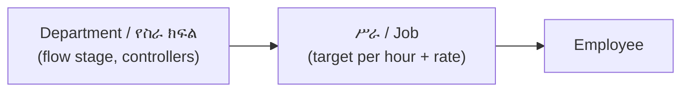

# 🧵 AHA Garment — v2 Master Build Plan

> **One file, one source of truth.** Built from the owner's original notes plus the settled decisions of October 3, 2026. Every page, role, rule and report below is what the system must do after the v2 update. Where this file disagrees with any older document (including the plan and decision files inside the v1 zip), **this file wins**.

**Legend:** ✅ keep · 🔧 change · ➕ new · 🗑️ remove · ⚠️ decision (a default was chosen and can be changed)

---

## 0. For the AI builder — read this first

### 0.1 What this is

AHA Garment is a Next.js + Prisma + PostgreSQL production and incentive system for a garment workshop (Amharic UI, Ethiopian calendar with 13 months). The code you receive is **v1**; none of the v2 changes exist in it yet. Your job is to turn v1 into v2 by following sections 2–12 in the order given in §12.1.

### 0.2 Rules for the build

1. **Server-side checks only count.** Hiding a menu item is not security. Every server action checks page access and `canControl(role, department)`.
2. **The server computes, the browser sends raw input.** Totals, targets, plus/minus, money and the acting user come from the server and the session, never from the form.
3. **Money uses `Decimal`**, never `parseFloat`. Dates are date-only UTC through one helper.
4. **Real data only.** No sample or placeholder numbers on any page.
5. **Do not delete money records.** Corrections are voids or new versions with a reason.
6. **Amharic UI everywhere**, Ethiopian dates, Arabic digits.
7. Work in the order of §12.1 and do not call a step done until its "Done when" test passes. Finish with the §12.2 checklist.
8. If something here is unclear, choose the default shown, record it in the README, and keep it changeable in `/settings` rather than hard-coding it.

### 0.3 Settled decisions (final)

| Topic | Decision |
|---|---|
| **Roles** | **One Owner only** (`ADMIN`, ADM-001). No Super Manager. Seven roles in §2. Workers do not log in. |
| **Rates** | **Two levels:** Department (flow stage) → Job (target per hour + rate per piece, on the dated incentive card). Each employee has one department and one job. |
| **Salary** | Monthly salary = fixed + bonus − deductions. **Bonus** is a setting, default **500 ETB**, editable by the Owner, applies from the next month. Paid only if the employee has at least one working day and was **አለ on every working day** of the month; no other exception. **Working day = a date with attendance saved.** A date with no attendance for anyone is a holiday or Sunday: no deduction, not counted for the bonus. Daily rate = fixed ÷ 30; ቀሪ −1 day, ፈቃድ −½ day, ሃኪም no deduction (but no bonus). Net never below 0. ጳጉሜን has no salary run and no bonus. |
| **Incentive shortfall** | Statements show Calculated (can be negative) and Payable (never below 0). Pay Payable. A shortfall never reduces the fixed salary. |
| **Who approves pay** | PMG or Owner **closes** a period; **only the Owner approves**. |
| **Fabric** | Two-sided: the store keeper records the issue, the cutting lead records the weight received. |
| **Flow ends at the shop.** | `/packing` and customer `Delivery` are removed. |

### 0.4 Where this plan differs from the owner's original notes

These are deliberate. Each is explained in §1. If the owner wants one reverted, change only that item.

| Original note | This plan | Reason |
|---|---|---|
| Consumption = pieces ÷ kg, alert if > 1 | **kg ÷ pieces**, alert if above the limit (default 1.00) | A T-shirt uses ~0.2 kg, so pieces ÷ kg ≈ 5 would alert every time |
| Limit editable in the cutting page | Edited in `/settings` by Owner and PMG, read-only on the cutting page | The person being measured should not set the limit |
| Cutting form deducts store directly | Store keeper issues, cutting lead receives | Otherwise table 2 can never show a difference |
| Order form has ምንጭ, one color/size | ምንጭ moved to shop receiving; order = lines of type/color/size/qty | Source belongs to receiving, and one order can hold several colors and sizes |
| Delete audit after 30 days, reports after 45 days | Same, but pay documents and money audit rows are kept | Needed for pay disputes |
| 14 day columns for a 15-day period | 15 columns (5 or 6 in ጳጉሜን) | Matches the title |
| Table 1 without an order column | **ትዕዛዝ** column added | Bundles are gone; the order number identifies items |
| Flow diagram ends ማሸግ → መጋዘን | Flow ends at the shop | Matches the written flow list |
| One rate per department | Rate per job inside a department | The incentive card has 24 rates inside 7 departments |

### 0.5 Inputs the builder needs but may not have

The client's sample PDFs (`incentive_14day.pdf`, `incentive_v4.pdf`, `salary_schedule.pdf`, `flow_tracker.pdf`) define the report layouts. The real incentive card, the real employee list (67 workers), the Amharic glossary review, a fixed-salary sample layout and the incentive pay day come from the client later; build with the defaults and keep them editable.

---

## Contents

0. [For the AI builder — read this first](#0-for-the-ai-builder--read-this-first)
1. [⚠️ Read first — problems in the notes and how I solved them](#1--read-first--problems-in-the-notes-and-how-i-solved-them)
2. [Roles and who sees which page](#2-roles-and-who-sees-which-page)
3. [Departments, jobs and the flow](#3-departments-jobs-and-the-flow)
4. [Page-by-page changes](#4-page-by-page-changes)
5. [Flow control (two-sided count) and the two report tables](#5-flow-control-two-sided-count-and-the-two-report-tables)
6. [Incentive periods and the 15-day report](#6-incentive-periods-and-the-15-day-report)
7. [Alerts — who gets what](#7-alerts--who-gets-what)
8. [Data model changes](#8-data-model-changes)
9. [What is removed](#9-what-is-removed)
10. [Migration of existing data](#10-migration-of-existing-data)
11. [Fixes carried over from the first analysis](#11-fixes-carried-over-from-the-first-analysis)
12. [Build order and acceptance checklist](#12-build-order-and-acceptance-checklist)
13. [Settled questions](#13-settled-questions)

---

## 1. ⚠️ Read first — problems in the notes and how I solved them

Most of the owner's notes are clear. These 17 points would cause bugs or wrong numbers if built exactly as written. Each shows the default applied.

### 🔴 Serious (the system would give wrong results)

| # | Problem | Why | Default applied |
|---|---|---|---|
| 1 | **Departments cannot carry incentive rates.** The owner's departments (ቆራጭ, ስፌት, ቅንጨባ…) are flow stages, but the incentive card has 24 different rates (ትከሻ ፍሬንት 1.00, ኪስ መለጠፍ 0.90, Interlock 1.20…) *inside* ስፌት. | One rate per department would make the real incentive sheet impossible to reproduce. | **Two levels:** Department (flow stage) → **ሥራ / Job** (carries target and rate). Each worker has one department and one job. See §3. |
| 2 | **The consumption formula is upside down.** You wrote: pieces ÷ kg, alert if > 1. | A T-shirt uses ~0.2 kg, so pieces ÷ kg ≈ 5 for every normal cut. The alert would fire **every time**. | **Consumption = kg ÷ pieces** (kg per piece). Alert if **> limit**. Default limit **1.00**, editable. See §4.5. |
| 3 | **Table 2 (store → cutting kg) would always show 0.** If the cutting form deducts fabric from the store automatically, the "store out" and "cutting received" are the same number. | The whole point is two *independent* counts. | **Store keeper records the issue** (kg out). **Cutting lead records the weight received** on the cutting form. Variance = out − received. See §4.5. |
| 4 | **Two-sided count only works if two different people enter the two sides.** In the owner's flow, ስፌት→ቅንጨባ are both controlled by the line supervisor, and ካውያ→ሂትፕረስ→ማሸግ by PMG/owner. The same person types "sent" and "received". | A person can make the numbers match. | Still record both sides, but (a) the receiver entry must come **later** than the sender entry, (b) the report marks these hops **"same controller"**, (c) the hourly incentive-box totals are shown beside it as an independent check. See §5. |
| 5 | **A running department is not a loss.** Sewing "received 400, finished 380" at 10:00 simply means 20 pieces are still on the machines. Same for a handover not yet received. | The red ⚠ would be on almost all day. | Three statuses: 🟡 **pending** (not yet received or still in progress), 🟢 **matched**, 🔴 **loss**. Red only after the receiver confirms, or after the cut-off (next working day 08:00 Eth. clock → 14:00 EAT is too late; the plan uses **end of day close**). See §5. |
| 6 | **Incentive table has 14 day columns but is titled "15 days".** Table 1 in the notes: "ቀን 1 … ቀን 14, የ15". | A period of 15 days needs 15 columns; Pagume needs 5 or 6. | Columns are generated from the period: **15** (or **5/6** for ጳጉሜን). See §6. |
| 7 | **Attendance has no half-day.** The 4 statuses (አለ፣ ቀሪ፣ ፈቃድ፣ የሃኪም ማስረጃ) removed the hours dropdown. | A worker who leaves at noon gets a full-day target → big negative incentive. | In the hourly incentive box a lead can mark an hour **"አልሰራም" (not worked)**; target counts only worked hours. Employees with ቀሪ/ፈቃድ/ሃኪም are **not listed** in the box. See §4.2 and §4.3. |

### 🟠 Important (rules unclear or contradictory)

| # | Problem | Default applied |
|---|---|---|
| 8 | **Alert recipients contradict.** You list PMG + ORD + ADM, then say "…sound for admin and production manager only". | 72h and 48h → Owner + PMG + Order Placer. **24h → Owner + PMG + Order Placer, with sound only for Owner and PMG.** |
| 9 | **Attendance scope.** SUP-001 and SUP-002 see the same list of ~67 workers. Who marks cutting, quality, ironing, hit-press, packing, store and admin workers? Who locks what? | Each worker has a **line (1/2/none)**. SUP-1 marks line 1, SUP-2 marks line 2, **PMG marks everyone without a line** (and anyone, if needed). The lock is **per supervisor and per day**. |
| 10 | **"Save only on the last page"** — a supervisor could lose pages 1–2, or save a half-filled list. | Each page is **auto-saved as draft** when pressing "ቀጣይ". The final **"አስቀምጥ"** on the last page checks that every page was opened, then **locks** the supervisor's rows. |
| 11 | **Order form has a "ምንጭ: ፋብሪካ / ትዕዛዝ ተመላሽ / ሌላ" field.** That field belongs to *shop receiving*, not to a production order. And one order has only one color/size. | Removed from the order form. Order = header + **lines** (type, color, size, quantity). Deadline is **date + hour**. |
| 12 | **Shop receive "source: factory"** should be the *"received" side* of the packing→shop handover, otherwise the same pieces are typed twice and never compared. | Receive from factory **must pick an order** and is matched against the packing "sent" count. |
| 13 | **Shop return to factory** is an *outgoing* movement, but the list shows it as a "source". | Shop has 3 movement types: **መቀበያ (receive) · ሽያጭ (sale) · ወደ ፋብሪካ ተመላሽ (return)**. "ምንጭ" applies to receive only. Balance = received − sold − returned. The "ሽጥ ✓" button in the balance table is a screenshot leftover and is removed. |
| 14 | **PMG powers are undefined** ("everything except some things") and PMG now also fills the incentive boxes and handovers for ካውያ, ሂትፕረስ and ማሸግ, sees salaries, and could close pay periods. | PMG **cannot**: open `/users`, `/audit`, delete audit, sell or receive in the shop, **approve** an incentive period, or **edit** salaries. See §2. Owner approves money. |
| 15 | **Audit delete at 30 days** also deletes proof of salary changes and period approvals. **Auto-delete of reports at 45 days** also deletes incentive statements. | Both are built as you asked, with safeguards: money-related audit rows and pay statements are **kept** (⚠️ switchable). See §4.14 and §4.13. |
| 16 | **Cutting lead editing the consumption limit** means the person being monitored sets the threshold. | Limit is edited in `/settings` by **Owner and PMG only**; the cutting page shows it read-only. |
| 17 | **Flow order differs from `flow_tracker.pdf`.** The owner's list: store, ቆራጭ, ስፌት, ቅንጨባ, **ጥራት, ካውያ, ሂትፕረስ**, ማሸግ, shop. The PDF text: … ኳሊቲ **before** ቅንጫባ, and ሂትፕረስ **before** ካውያ. | The plan follows **the owner's list**. The order is a **number on each department** (editable in settings), so changing it needs no code. |

---

## 2. Roles and who sees which page

### 2.1 The 7 roles

| Code | Role | Does | Sees |
|---|---|---|---|
| ADM-001 | **ባለቤት (Owner)** | Everything | Everything |
| ORD-001 | **Order Placer** | Takes orders, receives shop stock, sells | Orders + shop stock |
| PMG-001 | **Production Manager** | Follows and coordinates everything **except** the ⛔ list below | Almost everything |
| SUP-001 / SUP-002 | **Line Supervisor 1 / 2** | Incentive box + attendance (own line) | Own line only |
| CUT-001 | **Cutting lead** | Cutting incentive box, cutting form, handover | Cutting only |
| QCI-001 | **Quality inspector** | Quality incentive box, inspections, rework | Quality only |
| STK-001 | **Store keeper** | Fabric in/out | Store only |

**⛔ PMG cannot:** `/users` · `/audit` · purge the audit log · shop **receive / sale / return** (he can only *view* the balance) · **approve** incentive periods or salary schedules · **edit** salary amounts (view only).

Removed roles: `SUPER_MANAGER`, `HR_CLERK`, `FINISHED_GOODS_MANAGER`, `OPERATOR` (workers no longer log in). Implementation tip: **keep the enum names `ADMIN`, `PRODUCTION_MANAGER`, `STORE_KEEPER`, `CUTTING_MANAGER`, `QC_INSPECTOR`** and only change the Amharic labels; add `ORDER_PLACER` and `LINE_SUPERVISOR`. Far less code churn.

### 2.2 Page access matrix

`O` Owner · `P` PMG · `R` Order Placer · `S` Line Supervisor · `C` Cutting lead · `Q` Quality · `K` Store keeper

| Page | O | P | R | S | C | Q | K | Notes |
|---|:-:|:-:|:-:|:-:|:-:|:-:|:-:|---|
| `/dashboard` | ✅ full | ✅ full | mini | mini | mini | mini | mini | Mini = only own work, no graphs |
| `/attendance` | ✅ | ✅ | | ✅ own line | | | | Lock rule §4.2 |
| `/counts/enter` (incentive box) | ✅ all | ✅ all | | ✅ ስፌት + ቅንጨባ | ✅ ቆራጭ | ✅ ጥራት | | ካውያ/ሂትፕረስ/ማሸግ: O + P only |
| `/counts/close` (day close + PDF) | ✅ | ✅ | | | | | | |
| `/flow` (handover entries) | ✅ | ✅ | | ✅ | ✅ | ✅ | ✅ | Each controls own departments (§3.3) |
| `/cutting` | ✅ | ✅ | | | ✅ | | | |
| `/production` (order board) | ✅ | ✅ | | | | | | |
| `/production/orders` + `/new` | ✅ | ✅ | ✅ | | | | | |
| `/shop/receive`, `/shop/sale`, `/shop/return` | ✅ | | ✅ | | | | | |
| `/shop` (balance) | ✅ | ✅ view | ✅ | | | | | |
| `/quality` + `/quality/inspect` | ✅ | ✅ | | | | ✅ | | |
| `/materials`, `/suppliers` | ✅ | ✅ | | | | | ✅ | |
| `/employees` | ✅ | ✅ | | | | | | |
| `/incentive` | ✅ close + approve | ✅ close | | | | | | ⚠️ Q13 |
| `/salary`, `/payroll/*` | ✅ edit | ✅ view | | | | | | 50 per page |
| `/alerts` | own | own | own | own | own | own | own | §7 |
| `/reports` | ✅ | ✅ | | | | | | 45-day rule |
| `/users` | ✅ | | | | | | | |
| `/settings`, `/settings/incentive-card` | ✅ | ✅ | | | | | | |
| `/audit` | ✅ | | | | | | | + 30-day purge |

Implementation: replace the long permission list with **(a) a page-access map** (the table above) and **(b) one function `canControl(role, department)`** (§3.3). Every server action calls both. Hiding a menu item is not security — check on the server.

---

## 3. Departments, jobs and the flow

### 3.1 Two levels ⚠️



| Department (new) | Flow order | Jobs inside (today's 24 incentive rows) |
|---|---|---|
| ቆራጭ | 1 | ቆራጭ, ረዳት ቆራጭ, ስቲከር/ላስቲክ, ረዳት/ሱሪ መቁረጥ |
| ስፌት | 2 | ትከሻ ፍሬንት, ወገብ መቀምቀም, እጅ/ሳይድ, ኪስ መለጠፍ, ሳይድ, እጃት, እጅት ደርዝ እና ባጅ, Interlock ማጠፍ, ወገብ መቀጠም, የካንሻይ ወገብ ዝግጅት, ረዳት, መስመር ረዳት, መስመር ማሰራት, ቁጥጥር |
| ቅንጨባ | 3 | ቅንጫባ |
| ጥራት ተቆጣጣሪ | 4 | Quality, ዳሜጅ/ሱሪ መስረት |
| ካውያ | 5 | ካውያ |
| ሂት ፕረስ | 6 | ሂትፕረስ መለጠፍ |
| ማሸግ | 7 | ማሸግ |
| አስተዳደር | – | Owner, Order Placer, PMG… (no incentive) |

Store (ከመጋዘን) and Shop are the **start and end** of the flow: `store → ቆራጭ → ስፌት → ቅንጨባ → ጥራት → ካውያ → ሂት ፕረስ → ማሸግ → shop`.

> The assignment of today's 24 rows to departments is a reading of the names. Confirm with client staff (Q2).

### 3.2 Department settings (`/settings` — Owner + PMG)

A department has: Amharic name, **flow order**, **controller roles**, "counts in flow" yes/no, active. Owner and PMG can add/rename/reorder. Owner is always a controller (cannot be removed).

### 3.3 Who controls each department

| Department | Controllers |
|---|---|
| Store | Store keeper, PMG, Owner |
| ቆራጭ | Cutting lead, PMG, Owner |
| ስፌት, ቅንጨባ | Line supervisor (own line), PMG, Owner |
| ጥራት ተቆጣጣሪ | Quality inspector, PMG, Owner |
| ካውያ, ሂት ፕረስ, ማሸግ | PMG, Owner |
| Shop | Order Placer, Owner (PMG view only) |

`canControl(role, department)` reads this table (stored as `Department.controllers`). Used for the incentive box, handovers and rework.

---

## 4. Page-by-page changes

### 4.1 `/dashboard` — Owner + PMG (full)

🔧 Show exactly these blocks:

1. **የዛሬ ጠቅላላ ምርት** — pieces **per department** today (cut / sewn / trimmed / passed / ironed / pressed / packed). ⚠️ "total production" is not one number; Q6.
2. **ዒላማ ያሳኩ ሠራተኞች** — count with today's plus > 0, out of workers present.
3. **ንቁ የምርት ትዕዛዞች** — number + list.
4. **ክፍት ማስጠንቀቂያዎች** — number + latest 5.
5. **የ72/48/24 ትዕዛዞች** — three counters 🟢 🟡 🔴 (orders in each band).
6. **የባለፉት 14 ቀን የምርት ሂደት** — one line/bar chart.
7. **One graph: today's work** — pieces by hour (8 slots).
8. **⚡ ፈጣን የስራ ተግባራት** — buttons: new order, cutting form, attendance, day close, today's PDF.

Other roles: **no graphs**; a small page with only what they control (e.g. store keeper: low-stock + today's issues; Order Placer: orders + shop balance; supervisor: attendance status + their incentive box; cutting: today's cut jobs; quality: open rework).

### 4.2 `/attendance` — Owner, PMG, Line Supervisor

- 🔧 **Remove** the "የስራ ክፍል ምረጥ" selector. One list, **50 workers per page**, ቀዳሚ / ቀጣይ buttons (server-side paging: `skip/take`).
- 🔧 Columns: **ተ.ቁ · ሙሉ ስም · የስራ ክፍል · ሁኔታ (dropdown) · (saved check)**. The hours dropdown is replaced by status:

| Dropdown | Stored as | Salary effect (rule unchanged from spec v2) |
|---|---|---|
| አለ | `PRESENT` | none |
| ቀሪ | `ABSENT_UNAUTHORIZED` | −1 day |
| ፈቃድ | `ABSENT_AUTHORIZED` | −½ day |
| የሃኪም ማስረጃ | `SICK_LEAVE` | no penalty |

- ✅ Keep the **የጋራ መመዝገቢያ** (bulk set) — per page / per department.
- ➕ **Save and lock** (⚠️ #9, #10):
  - "ቀጣይ" auto-saves the page as draft.
  - On the **last page** the supervisor sees **"አስቀምጥ"**. It requires that every page was opened, then **locks that supervisor's rows** for that day.
  - After lock, the rows are editable **only by Owner and PMG** (with an audit entry).
  - SUP-1 sees line 1 workers, SUP-2 line 2; PMG/Owner see all (and are the only ones who can mark workers without a line).
- Default status on a fresh day is **አለ**; the final check blocks saving if any page was never opened.
- The data feeds the monthly attendance + salary pages (§4.12) and the employee list in the incentive box (§4.3).

### 4.3 `/counts/enter` — hourly incentive box

- 🔧 5 fields only: date+hour (auto), department (auto), employee (dropdown), pieces this hour, **+/- vs target (auto)**.
- 🔧 The employee dropdown lists **only workers marked አለ today** in the lead's departments. If attendance is not saved yet, show all with a yellow notice.
- ➕ A **"አልሰራም"** option for an hour (half-day workers) — that hour has no target and no penalty.
- 🔧 The **server recomputes everything** (total, target, plus, minus) and takes the user from the session. The browser sends only `{date, hourSlot, employeeId, pieces}`.
- Scope: a lead enters only for departments they control (§3.3). PMG/Owner can enter for all.
- Day close (`/counts/close`, Owner + PMG) is blocked while some present worker × hour is still empty (list shows what is missing; Owner can override with a reason).

### 4.4 `/production` — orders

**`/production`** (Owner, PMG) 🔧 **order board** replaces bundles:

```
ቆረጣ
  ORD-00012 · ነጭ ቲ-ሸርት · 40 ፍሬ
  ORD-00014 · ጥቁር ትራክ ሱሪ · 120 ፍሬ
ስፌት
  ORD-00011 · …
```

One block per department, listing each order and how many pieces are currently inside (= received − sent on to the next department). Click an order → its flow table (§5).

**`/production/orders/new`** (Owner, PMG, Order Placer) 🔧 fields:

| Field | Type |
|---|---|
| ቀን | today, automatic |
| ትዕዛዝ ቁጥር | automatic `ORD-00001` (5 digits, unique sequence, never reused) |
| **Lines** (add as many): ስታይል/type (ቲ-ሸርት, ትራክ ሱሪ…), ቀለም, ሳይዝ (S/M/L/XL/XXL), ብዛት | dropdown, dropdown, dropdown, number |
| የማጠናቀቂያ ቀን | **date + hour** (⚠️ if only a date is given, default hour = end of working day) |

No price, no "ምንጭ" field (⚠️ #11). Types / colors / sizes are small lists managed in `/settings`. `/production/styles` and BOM are removed.

**Countdown** (computed from `deadlineAt`; shown everywhere with the same colours):

| Hours left | Colour | Message → recipients |
|---|---|---|
| ≤ 72 | 🟢 | "ትዕዛዝ ORD-XXX በ3 ቀን ይቀራል። የቆረጣ ዝግጅት ጀምር" → PMG + Order Placer + Owner |
| ≤ 48 | 🟡 | "ትዕዛዝ ORD-XXX በ2 ቀን ይቀራል። የስፌት መስመር ሂደት አረጋግጥ" → same |
| ≤ 24 | 🔴 | "ትዕዛዝ ORD-XXX በ1 ቀን ይቀራል! የፊኒሺንግ ፍጥነት ጨምር!" → same, **sound for Owner and PMG only** |
| < 0 | ⚫ | "ዘግይቷል" |

Each threshold fires **once per order** (`OrderAlert` unique per order + threshold). Order created with less time left fires only the most urgent one. Changing the deadline resets unfired thresholds. Done or cancelled orders stop.

> **Trigger:** the dashboard and `/production` compute the countdown live on every page load. The Telegram push needs a scheduler: use a free external cron (e.g. cron-job.org) calling `/api/cron/orders` with a secret **every 30–60 min**. Vercel's free plan only allows daily cron.

### 4.5 `/cutting` and `/cutting/new` — Cutting lead, Owner, PMG

**Form:**

| Field | Rule |
|---|---|
| የምርት ትዕዛዝ * | dropdown of active orders |
| ጨርቅ (from store) | dropdown of fabric materials; shows quantity available for cutting |
| የተሰጠ ጨርቅ ሚዛን (ኪ.ግ) | number, weight received by cutting |
| የተቆረጡ ፍሬዎች ብዛት * | number |
| የተቆረጠበት ቀን | date, defaults to today |

**Consumption (ቀመር):** `consumption = kg ÷ pieces` (kg per piece), shown live under the form.
- `consumption > limit` → alert **"ብክነት አለ"** (default limit **1.00**, ⚠️ #2, #16).
- Note: 1 kg per piece is very loose for T-shirts (~0.2 kg). Default 1 stays as requested; recommended later: a limit per type.

**Store check** ⚠️ #3 (recommended two-sided design):
1. **Store keeper** records the issue: fabric, kg, destination = ቆራጭ (this reduces the store balance and is "store out" in table 2).
2. **Cutting lead** picks the fabric on the cutting form. Available for cutting = Σ issued to cutting − Σ already used in cut jobs.
3. `kg > available` → error **"በቂ ጨርቅ የለም"** and nothing is saved.
4. `kg ≤ available` → saved; remaining available is shown. Store remaining = store balance after the keeper's issue.
5. **Table 2 variance** = store "ያወጣ" − cutting "የተቀበለ".

> The original single-step version (cutting form deducts the store directly) would work, but **table 2 could never show a difference**. Settled in Q4: two-sided.

Saving a cut job also creates the first **handover** entry: ቆራጭ → ስፌት "sent = pieces cut" for that order (§5).

### 4.6 Shop — Owner + Order Placer (PMG views balance)

Three simple pages (menu group "ሱቅ"):

**① የሱቅ እቃ መረከቢያ** (`/shop/receive`)
ቀን (auto) · ምንጭ (ፋብሪካ / ትዕዛዝ ተመላሽ / ሌላ) · ስታይል · ቀለም · ሳይዝ · ብዛት — **no price field**. If ምንጭ = ፋብሪካ → also pick the **order**; it is matched with the packing "sent" count (§5).

**② ውጪ ስክሪን — ሽያጭ** (`/shop/sale`) — the only place with a price
ቀን (auto) · ስታይል + ቀለም + ሳይዝ · የሚወጣ ብዛት · የአንድ ፍሬ ዋጋ (ብር) · **ጠቅላላ ገቢ (auto = ብዛት × ዋጋ)** · የተገዛው ሰው.
Rules: quantity > balance → rejected; price required; total stored.

**③ ወደ ፋብሪካ ተመላሽ** (`/shop/return`)
ስታይል · ቀለም · ሳይዝ · ብዛት · reason (ጥራት ችግር / ያልተሸጠ). No price. Server **rejects** a price on receive/return (not only hidden in the UI). The returned pieces go to the **quality department as rework** (⚠️ Q9).

**④ የሱቅ ቀሪ** (auto, Owner/PMG/Order Placer)

| ስታይል | ቀለም | ሳይዝ | የገባ | የወጣ | ተመላሽ | ቀሪ |
|---|---|---|---|---|---|---|
| ነጭ ቲ-ሸርት | ነጭ | L | 400 | 120 | 0 | **280** |
| ትራክ ሱሪ | ጥቁር | XL | 200 | 45 | 0 | **155** |

`ቀሪ = የገባ − የወጣ − ተመላሽ`. `ቀሪ = 0` → **"አልቋል"** alert (Owner, Order Placer, PMG). Corrections = void with a reason (never delete).

### 4.7 `/quality` and `/quality/inspect` — Quality, Owner, PMG

- 🔧 Inspect **by order** (+ color/size), not by bundle.
- 🔧 Defect field renamed **"ጉድለቱ የተፈጠረበት የስራ ክፍል"** — a dropdown of the **departments** (replaces the old stage list). This controls the flow: the defect and its rework are charged to that department.
- Rework log stays; repaired pieces return to the flow and are visible when a variance is investigated (§5).
- Open question: what the quality box counts (inspected, passed, or both) — Q7.

### 4.8 `/materials` and `/suppliers` — Store keeper, PMG, Owner

- 🔧 **One page only: "ጨርቅ መቀበያ".** `/materials/new` and `/materials/receive` are merged:
  - Pick an existing material **or** type a new one (name, unit, minimum level, **kind = fabric / other**) in the same form.
  - Then supplier (pick or add), lot number, quantity, date. SKU is automatic.
  - One Save creates the material (if new) and the receive movement in one transaction.
- ✅ Material list, movements and low-stock alert stay.
- ➕ **Fabric issue to cutting** button (the store keeper's "out" for table 2).

### 4.9 `/employees` — PMG, Owner

- 🔧 Each employee: name, **department**, **job** (ሥራ), **line (1/2/none)**, active, notes.
- Employee list paged at 50.
- Salary editing is **Owner only** (PMG sees it read-only, ⚠️ #14).

### 4.10 `/incentive`

See §6. Short version: month header **"ወቅታዊ ወር፦ መስከረም 2019 ዓ.ም"**, two close buttons, a **"ወርሃዊ የኢንሴንቲቭ ማጠቃለያ"** button, and previous/next month navigation.

### 4.11 `/settings` — Owner + PMG

| Section | Action |
|---|---|
| ➕ ዲፓርትመንቶች | create/rename/reorder, set controllers (§3) |
| ➕ ዝርዝሮች | types (ቲ-ሸርት…), colors, sizes |
| 🔧 **የተፈቀደ ከፍተኛ የብክነት ወሰን (ኪ.ግ ለአንድ ፍሬ)** | default **1.00**, editable (label and unit change from % to kg/piece) |
| ✅ የወርሃዊ ደሞዝ መክፈያ ቀን | unchanged |
| ➕ የክትትል ጉርሻ (attendance bonus, ETB) | default **500**, Owner only; dated, applies from the next month |
| ✅ የኢንሴንቲቭ ካርድ (`/settings/incentive-card`) | unchanged layout; now **per ሥራ**; see effective-date rule below |
| 🗑️ `/settings/periods` | removed (§6) |
| 🗑️ ቴሌግራም ቦት ቅንብር | removed — configured in `.env` |
| 🗑️ የመላኪያ ሁኔታ | removed — shown on `/reports` |

**Effective-date rule ("ሥራ ላይ የሚውልበት ቀን") — avoid errors** ⚠️:
- The current code prices a whole period with the card valid at the period **end**, so a change on day 10 silently re-prices days 1–9.
- Fix: a new rate can start **only on the 1st or the 16th of an Ethiopian month** (or day 1 of ጳጉሜን). The editor rejects other dates, closes the previous card (`effectiveTo = day before`), and refuses overlaps and gaps.
- Daily lookups use the card valid **on that day**. Dates are stored as date-only (UTC) with one helper — no `setHours(0,0,0,0)`.
- The incentive-card page was not reviewed; test: change a rate, generate a statement for an older period, and confirm the old statement is unchanged.

**Telegram via `.env`:** use server-only variables per role, e.g. `TELEGRAM_BOT_TOKEN`, `TELEGRAM_CHAT_OWNER`, `_PMG`, `_ORDER`, `_STORE`, `_CUTTING`, `_QUALITY`, `_SUP1`, `_SUP2`, `TELEGRAM_CHAT_DEV`. **Remove all `NEXT_PUBLIC_TELEGRAM_*`** (they expose chat IDs to the browser). Changing a chat ID needs a redeploy — acceptable.

### 4.12 Pay pages — `/salary`, `/payroll/monthly-incentive`, `/payroll/monthly-salary`, `/payroll/monthly-attendance`, `/payroll/monthly-report`

- Owner and PMG only.
- 🔧 **Server-side paging, 50 rows per page** with ቀዳሚ / ቀጣይ. Totals and the department summary are computed over **all** rows in a separate query (not only the visible page). PDF/print exports include all rows.
- 🔧 Real data only: remove any sample/placeholder numbers; all values come from attendance, incentive lines and salary records for the selected **Ethiopian** month (1–13).
- 🔧 **Three separate documents** (no "total compensation" that adds salary + incentive).
- 🔧 Monthly salary = fixed + bonus − deductions. **Bonus** is a setting (default **500 ETB**, Owner edits, applies from the next month). Paid only if the employee has ≥ 1 working day and was አለ on **every working day**. **Working day = a date with attendance saved**; a date with no attendance for anyone is a holiday/Sunday (no deduction, not counted). Daily rate = fixed ÷ 30; ቀሪ −1 day, ፈቃድ −½ day, ሃኪም no deduction (but no bonus). Net never below 0. **ጳጉሜን has no salary run and no bonus.**
- ➕ **Pre-run checklist (blocks the run until the Owner confirms):** dates with no attendance saved for anyone; employees with no record on a date saved for others.
- Test values: fixed 6,500 → 30 days = **7,000.00** · 1 day ቀሪ = **6,283.33** · 1 day ፈቃድ = **6,391.67** · 2 days ሃኪም = **6,500.00** · 26 saved days all present = **7,000.00** · 26 saved days, 1 ቀሪ = **6,283.33**.

### 4.13 `/reports` — Owner + PMG

- ✅ Shows **real saved reports only**: daily PDF (production + the 2 flow tables), incentive statements, monthly summaries, salary/attendance documents. Each row: type, period, created, **Telegram status** (sent / failed + retry), download.
- ➕ Reports are **stored in the database** (PDF + metadata, `GeneratedReport`).
- ➕ **45-day rule:** reports older than 45 days are deleted. Cleanup runs when the page is opened (no cron needed).
- ⚠️ **Exempt pay documents** (incentive statements, monthly incentive summary, salary schedule) from the 45-day rule — they are needed for pay disputes. Default: exempt. Change in Q11.

### 4.14 `/audit` — Owner only

- ➕ **"ከ30 ቀን በፊት ያሉትን ሰርዝ"** button (moved from `/counts/close`, which loses it).
- Rules ⚠️ #15: owner only · shows how many rows will be deleted · typed confirmation · **downloads a CSV of the rows first** · **keeps money-related rows** (salary changes, period close/approve, offences/suspensions, corrections) · writes its own `PURGE_AUDIT_LOG` entry which is never deleted.
- The old purge used "before the 1st of the current *Gregorian* month". The new one is a rolling **30 days**.

### 4.15 `/alerts`

See §7.

### 4.16 `/login` — install prompt

Keep the install banner. Fix the repeat-prompt problem on Android:

- Do **not** show it when the app is already running installed (`display-mode: standalone` or `navigator.standalone`).
- Save a flag when the browser fires `appinstalled`, and never show again after that.
- **Two dismiss buttons:** "ቆይቶ" (snooze 7 days) and **"ዳግም አትጠይቀኝ" (never ask)** → stored in `localStorage`.
- iOS has no install event: show the short "Share → Add to Home Screen" hint once, with the same never-ask button.
- The fix goes in `pwa-init.tsx`.

---

## 5. Flow control (two-sided count) and the two report tables

### 5.1 Principle (the owner's text, unchanged)

Every movement is counted **twice**: the sender says "ላክሁ", the receiver says "ተቀብያለሁ". Equal = no mistake. Different = pieces were lost **between those two departments**.

Steps when a difference is found: ① recount the same day in that department · ② check the **Rework** log (pieces may be waiting there) · ③ if still missing, report to the manager. A non-zero cell turns **red** with **"⚠ ውጥረት አለ"**; nothing is calculated by hand.

### 5.2 One record per transfer

```text
Handover { order, color, size, fromDept, toDept, unit (PCS | KG),
           sentQty, sentBy, sentAt, receivedQty?, receivedBy?, receivedAt? }
```

Flow hops: `store→ቆራጭ (kg)` · `ቆራጭ→ስፌት` · `ስፌት→ቅንጨባ` · `ቅንጨባ→ጥራት` · `ጥራት→ካውያ` · `ካውያ→ሂት ፕረስ` · `ሂት ፕረስ→ማሸግ` · `ማሸግ→shop`. Hops are generated from the department **flow order**, so adding or moving a department changes them automatically. Items are identified by **order number + color + size** — no bundle codes.

### 5.3 Status of a hop (⚠️ #5)

| Status | Condition |
|---|---|
| 🟡 pending | sent, not yet received — or order still running inside the department |
| 🟢 matched | sent = received |
| 🔴 loss | received ≠ sent after the receiver confirmed, or at day close |
| 🔵 same controller | sender and receiver are the same person/role group (⚠️ #4) — shown as a small tag, with the incentive-box total next to it |

Opening a red cell creates an **investigation row**: status (recount / found in rework / reported / resolved), reason found, lead signature name.

### 5.4 Table 1 — per order (add to `/counts/close` PDF)

| ተ.ቁ | ትዕዛዝ | ቀለም/ሳይዝ | A. ቆረጣ ላከ | B. ስፌት ተቀበለ | C. ስፌት ጨረሰ | D. ኳሊቲ አለፈ | E. ፊኒሺንግ ተቀበለ | F. ማሸግ ጨረሰ | ድምር F−A | ሁኔታ | ማስታወሻ |
|---|---|---|---|---|---|---|---|---|---|---|---|

- The owner's column set A–F is kept; **ትዕዛዝ** is added (because bundles are gone).
- Variances ①–⑤ shown under the columns (B−A, C−B, D−C, E−D, F−E).
- ድምር F−A with the "⚠ ጠቅላላ ውጥረት" total row.
- `ሁኔታ` = ✓ ትክክል / ⚠ ውጥረት −N / 🟡 በሂደት.
- Columns follow the departments listed in §3; the middle hops (ቅንጨባ, ሂትፕረስ) are inside the totals and appear in the order detail page.
- **Test:** columns 1800/1795/1790/1785/1783/1783 → variances −5/−5/−5/−2/0, total **−17**.

### 5.5 Table 2 — daily department flow

Header: `ቀን: ____ | የቀን ጨርቅ ከመጋዘን ወጥቷል: ____ ኪ.ግ`

| ዲፓርትመንት | የተቀበለ (ገቢ) | ያወጣ (ውጪ) | ፍልልያ | የተገኘበት ምክንያት | ኃላፊ ፊርማ |
|---|---|---|---|---|---|
| መጋዘን → ቆረጣ (ጨርቅ/ኪ.ግ) | cutting received | store out | out − received | | |
| ቆረጣ → ስፌት (ፍሬ) | | | | | |
| ስፌት ውስጥ (ገቢ vs ጨረሰ) | | | | | |
| ስፌት → ቅንጨባ … ማሸግ → shop | | | | | |

Loss % = variance ÷ sent. One row per hop of that day.

### 5.6 `/counts/close` PDF

The existing daily production sheet gets **Table 1 and Table 2 as extra pages**, plus the audit page that exists today is **removed** from this PDF (audit is now Owner-only on `/audit`). The PDF is saved into `GeneratedReport` (§4.13) and sent to Telegram; failures show on `/reports`.

---

## 6. Incentive periods and the 15-day report

### 6.1 Fixed calendar — no settings

| Ethiopian month | Period 1 | Period 2 |
|---|---|---|
| ሁሉም ወር 1–12 | ቀን **1–15** | ቀን **16–30** |
| ጳጉሜን (13) | ቀን **1 – 5** (or **1 – 6** in a leap year) | – (one period only) |

- **Pagume leap rule:** Ethiopian year `Y` is a leap year when `Y mod 4 = 3`. So **2019 E.C. is a leap year (ጳጉሜን has 6 days)**; 2018 has 5. Use the existing calendar library but add unit tests for this.
- Period dates come from a **pure function** `periodsOf(ethYear, ethMonth)`. No `PeriodConfig` table, no `/settings/periods` page; `IncentivePeriod` rows are created when someone presses close.
- Existing periods created by the old rule (day 20 → day 4 / day 5 → day 19) are **old-style**: keep them read-only; do not recompute.

### 6.2 `/incentive` page

```
ወቅታዊ ወር፦ መስከረም 2019 ዓ.ም          [ ◀ ቀዳሚ ወር ]  [ ቀጣይ ወር ▶ ]

[ የ1ኛ ወቅት ክፍያ (ከቀን 1-15) ዝጋ ]     [ የ2ኛ ወቅት ክፍያ (ከቀን 16-30) ዝጋ ]
[ ወርሃዊ የኢንሴንቲቭ ማጠቃለያ ]
```

- In ጳጉሜን only one button: **"የጳጉሜን ወቅት ዝጋ (ከቀን 1-5/6)"**.
- Before closing, show a **checklist**: days without day-close, workers without a job/card, workers with no counts. Closing is allowed with a reason, never silently.
- **Every active worker gets a line** (zero if no counts) — the old code skipped them.
- Closing runs in **one database transaction**; money totals use Decimal, not `parseFloat`.
- Statuses: `DRAFT → CLOSED (draft statement) → APPROVED (locked)`. Approve = Owner only (⚠️ Q13).
- **Corrections after approval** create a new version with a reason; the old one is kept.

### 6.3 Report generated on close (both are in one PDF + Excel)

**Table 1 — የ15 ቀን ኢንሴንቲቭ ማስሊያ ሰንጠረዥ (Bi-Weekly Incentive Calculation)**

Header: `የቆጠራ ዙር: ከ ቀን ___ እስከ ቀን ___ (15 ቀናት) | የክፍያ ቀን: ___ | ማረጋገጫ: ___` — the "(15 ቀናት)" text and the number of day columns come from the period (**15**, or **5/6** for ጳጉሜን).

| ተ.ቁ | ስም | ሥራ | ሳንቲም | ቀን 1 … ቀን **15** | የ15 ቀን ድምር (+/−) | ኢንሴንቲቭ (ብር) |
|---|---|---|---|---|---|---|

Daily value = signed (pieces − target). Total = Σ daily − 2 × mistakes. Incentive = total × rate. (Same arithmetic as the client's `incentive_14day.pdf`, which I verified: 3,446 pieces → 2,942.40 ETB.) Support rows (no rate) print "–".

**Table 2 — የ15 ቀን ኢንሴንቲቭ ማጠቃለያ በዲፓርትመንት**

| ተ.ቁ | ዲፓርትመንት / ሥራ | ሰራተኞች | የ15 ቀን ድምር ፍሬ | ጠቅላላ ኢንሴንቲቭ (ብር) |
|---|---|---|---|---|

with the department bar chart. Rows are by **ሥራ** (24 rows) with a subtotal for each of the 7 departments.

### 6.4 ወርሃዊ የኢንሴንቲቭ ማጠቃለያ button

Generates the month summary for the selected Ethiopian month: Period 1 + Period 2 (or the ጳጉሜን period) per ሥራ and department, plus the chart. Sources: approved period lines only; a not-yet-closed period shows "ገና አልተዘጋም" instead of zeros. Result is saved in `/reports`.

### 6.5 Negative totals

Show **both** columns: **Calculated** (can be negative, as in the client's sheet) and **Payable** (never below 0). The client's printed total (2,942.40) includes −8.00 for one worker; floored it would be 2,950.40. Pay Payable until Q3 is answered.

---

## 7. Alerts — who gets what

Rule: **an alert is shown only to the roles below** (in-app and Telegram). Nobody sees the whole list.

| Alert | Owner | PMG | Order Placer | Supervisor | Cutting | Quality | Store |
|---|:-:|:-:|:-:|:-:|:-:|:-:|:-:|
| ዝቅተኛ ክምችት (low stock) | ✅ | ✅ | | | | | ✅ |
| **የጨርቅ ብክነት** | ✅ | ✅ | | | ✅ | | |
| ትዕዛዝ 72 / 48 / 24 h | ✅ | ✅ | ✅ | | | | |
| ዘግይቷል (overdue order) | ✅ | ✅ | ✅ | | | | |
| የእቃ ፍሰት ፍልልያ (flow variance) | ✅ | ✅ | | ✅ ² | ✅ ² | ✅ ² | ✅ ² |
| ቀኑ አልተዘጋም (day not closed) | ✅ | ✅ | | | | | |
| አቴንዳንስ አልተቀመጠም | ✅ | ✅ | | ✅ own | | | |
| የሱቅ እቃ አልቋል | ✅ | ✅ | ✅ | | | | |
| ከፍተኛ ጉድለት/ሪወርክ | ✅ | ✅ | | | | ✅ | |
| ሪፖርት መላክ አልተሳካም | ✅ | | | | | | |

² Only the two departments that share the hop.

- **"✓ ፍታ" (resolve)** — only Owner and PMG; it **deletes the alert row** (as requested) and writes an audit entry. If the condition is still true at the next check (e.g. stock still low), the alert **comes back** — this is correct, tell the staff.
- Fix from the first analysis: stop reusing `UNUSUAL_COUNT` for other things; add types `ORDER_COUNTDOWN`, `FLOW_VARIANCE`, `SHOP_SOLD_OUT`, `CONSUMPTION`, `ATTENDANCE_MISSING`, `HR_CASE`, `SALARY_CHANGED`.
- Telegram goes to the per-role chats in `.env` (§4.11).

---

## 8. Data model changes

```prisma
// ── People & structure ─────────────────────────────────────────
enum Role { ADMIN PRODUCTION_MANAGER ORDER_PLACER LINE_SUPERVISOR
            CUTTING_MANAGER QC_INSPECTOR STORE_KEEPER }

model Department {                 // NEW meaning: flow stage
  id String @id @default(cuid())
  nameAm String @unique
  flowOrder Int?                   // null = not in flow (አስተዳደር)
  controllers Role[]               // Owner implicit
  isActive Boolean @default(true)
  jobs Job[]
}
model Job {                        // = today's 24 "departments" with rates
  id String @id @default(cuid())
  nameAm String
  departmentId String
  department Department @relation(fields:[departmentId], references:[id])
  cards IncentiveCard[]
}
model Employee {                   // + jobId, lineNo
  departmentId String
  jobId String?
  lineNo Int?                      // 1, 2, or null
}
model IncentiveCard { jobId String  /* replaces departmentId */ ... }

// ── Attendance ────────────────────────────────────────────────
enum AttendanceStatus { PRESENT ABSENT_UNAUTHORIZED ABSENT_AUTHORIZED SICK_LEAVE }
model Attendance { employeeId String; date DateTime @db.Date;
                   status AttendanceStatus; enteredById String; lockedAt DateTime?
                   @@unique([employeeId, date]) }
model AttendanceSubmission { date DateTime @db.Date; supervisorId String;
                             submittedAt DateTime; @@unique([date, supervisorId]) }

// ── Orders ────────────────────────────────────────────────────
model ProdOrder  { orderNo String @unique  /* ORD-00012, sequence */
                   deadlineAt DateTime; status OrderStatus; createdById String
                   lines OrderLine[] }
model OrderLine  { orderId String; typeId String; color String; size Size; qty Int }
model OrderAlert { orderId String; threshold Int; firedAt DateTime
                   @@unique([orderId, threshold]) }

// ── Flow ──────────────────────────────────────────────────────
model Handover { orderId String; color String; size Size?; fromDeptId String?; toDeptId String?
                 unit Unit /* PCS|KG */; sentQty Decimal; sentById String; sentAt DateTime
                 receivedQty Decimal?; receivedById String?; receivedAt DateTime? }
model FlowInvestigation { handoverId String; status String; reasonFound String?
                          signedBy String?; resolvedAt DateTime? }

// ── Cutting ───────────────────────────────────────────────────
model CutJob { orderId String; fabricId String; kgReceived Decimal; piecesCut Int
               consumption Decimal  /* kg ÷ pieces */; limitUsed Decimal; date DateTime @db.Date }

// ── Shop ──────────────────────────────────────────────────────
model ShopMovement { type ShopMoveType /* RECEIVE|SALE|RETURN */; source ShopSource?
                     orderId String?; typeId String; color String; size Size; qty Int
                     unitPrice Decimal?; total Decimal?; buyerName String?
                     voidedAt DateTime?; voidReason String? }

// ── Settings ──────────────────────────────────────────────────
model SalarySetting { effectiveFrom DateTime @db.Date; attendanceBonus Decimal @default(500) } // dated, never edited in place

// ── Reports ───────────────────────────────────────────────────
model GeneratedReport { type String; periodKey String; pdf Bytes; sentStatus String
                        createdAt DateTime; createdById String }
```

Hourly counts: **sheet keyed by (date, department)** instead of (date, operation); line = (employee, hour slot, pieces, notWorked). Keep `Decimal` for money.

---

## 9. What is removed

| 🗑️ | Why |
|---|---|
| `/production/styles`, `BomItem`, `StyleStageRoute`, `GarmentStyle` (→ simple type list) | no longer needed |
| `Bundle`, `BundleStageLog`, `/production/bundles`, bundle QR tags `/api/tag/*`, `/quality/inspect/[bundleId]`, `/packing/dispatch/[bundleId]` | tracking by **order number** |
| `Operation`, `OperationDeptMapping` (13 reporting groups) | replaced by department → job |
| `/settings/periods`, `PeriodConfig` | periods are fixed by the calendar (§6) |
| Telegram link UI, delivery-status block in settings | `.env` + `/reports` |
| `/materials/new` or `/materials/receive` (one of them) | merged page |
| Audit purge button on `/counts/close` | moved to `/audit` |
| Roles `SUPER_MANAGER`, `HR_CLERK`, `FINISHED_GOODS_MANAGER`, `OPERATOR` | simplified roles |
| Merged "total compensation" on payroll pages | three separate documents |
| `/packing` + `Delivery` (customer dispatch) | the flow now ends at the **shop**; ⚠️ confirm in Q8 |

---

## 10. Migration of existing data

1. **Baseline first:** `prisma migrate dev --name baseline` (the project has no migrations folder).
2. **Roles** — map users, then change the enum (Postgres needs add-values → update rows → recreate the type):

| Old | New |
|---|---|
| `ADMIN` (ADM-001) | `ADMIN` (Owner) |
| `SUPER_MANAGER` (MGR-001) | merge into Owner: deactivate the user |
| `PRODUCTION_MANAGER` (PRD-001) | `PRODUCTION_MANAGER` (PMG-001) — rename code |
| `STORE_KEEPER`, `CUTTING_MANAGER`, `QC_INSPECTOR` | same |
| `FINISHED_GOODS_MANAGER`, `HR_CLERK`, `OPERATOR` | deactivate users; PMG takes over the duties |
| — | new: `ORDER_PLACER` (ORD-001), `LINE_SUPERVISOR` (SUP-001, SUP-002) |

3. **Departments:** rename the current 24 `Department` rows to `Job`; create the 8 new departments; assign each job to a department (§3.1); set employees' `departmentId`, `jobId`, `lineNo`; move `IncentiveCard.departmentId` → `jobId`.
4. **Attendance:** `hoursWorked > 0 → PRESENT`, `0 → ABSENT_UNAUTHORIZED`, `-1 → ABSENT_AUTHORIZED`; then drop `hoursWorked`.
5. **Hourly counts:** re-key sheets from operation to department; keep h1–h8.
6. **Bundles:** export, then drop. Create `Handover` rows only for orders still open.
7. **Orders:** copy `ProdOrder.dueDate` → `deadlineAt` (hour = end of working day); convert `ORD-0001` → `ORD-00001`.
8. **Incentive periods:** leave old-style periods read-only.
9. **Real data:** load the 67 workers and their real salaries (the client's sheet has no salary amounts yet).
10. Test on a **copy** of the production database first.

---

## 11. Fixes carried over from the first analysis

Still required:

| Priority | Fix |
|---|---|
| **P0** | Remove `"use server"` from `lib/incentive/periods.ts` (anyone could call `approvePeriod`) · server recomputes hourly counts and takes the user from the session · scope offences to the department and derive their level · one UTC date helper (`toDayKey`) · transactions for period close and day close · every active worker gets an incentive line |
| **P1** | zod validation in all actions · order/period numbers from a sequence · lockout + forced PIN change (default `1234` today) · audit entries for any date override · no `enteredById` from the browser · tag/QR endpoint dies with bundles |
| **P2** | Remove debug `console.log` in PDF code · fix README (cron/worker are disabled) and `.env.example` (`DIRECT_URL`) · migrations folder |

---

## 12. Build order and acceptance checklist

### 12.1 Order of work

| Step | Work | Done when |
|---|---|---|
| 0 | P0 fixes + baseline migration | Security tests pass |
| 1 | Roles, page-access map, `canControl`, department/job model, migration | Every page rejects the wrong role on the server |
| 2 | Employees, attendance (status, paging, save+lock), 50-per-page pay pages | Attendance rules and salary tests pass |
| 3 | Hourly box (server recompute, present-only list, not-worked) + day close | Totals match the client sheet |
| 4 | Fixed periods (§6), 15-day report, department summary, monthly summary | Real 67-worker data reproduces 3,446 / 2,942.40 |
| 5 | Orders (lines, countdown, alerts), order board, dashboards | 72/48/24 fire once each |
| 6 | Store issue, merged materials page, cutting form + consumption | "በቂ ጨርቅ የለም" and alert work |
| 7 | Handovers, flow tables 1 and 2, investigations, `/counts/close` PDF | Sample gives −17 |
| 8 | Shop receive / sale / return / balance | Balance and "አልቋል" work |
| 9 | Alerts matrix, `/reports` store + 45-day cleanup, audit purge, settings cleanup, PWA prompt | Checklist below |

### 12.2 Acceptance checklist

**Calendar / incentive**
- [ ] Periods for 12 normal months are 1–15 and 16–30; ጳጉሜን is 1–5 (2018) and 1–6 (2019).
- [ ] The statement shows 15 day columns (5/6 in ጳጉሜን) and "(15 ቀናት)".
- [ ] Real data: 3,446 pieces → **2,942.40** (Calculated); worker 16 = −8 → Calculated −8.00, Payable 0.00.
- [ ] A rate change dated mid-period is rejected; an older statement is unchanged after a new rate.

**Attendance / salary**
- [ ] 50 per page with ቀዳሚ/ቀጣይ; no department selector.
- [ ] After a supervisor presses አስቀምጥ, his rows are read-only for him and editable for Owner/PMG.
- [ ] 6,500 → 7,000.00 · 6,283.33 · 6,391.67 · 6,500.00; 26 saved days (Sundays unsaved) all present → 7,000.00.
- [ ] Salary run is blocked while an unsaved date or a missing employee record is unconfirmed.

**Orders / cutting / shop**
- [ ] Order with 80 h left: no alert; 72/48/24 each fire once; 24 h has sound for Owner/PMG only.
- [ ] Cutting: 100 kg for 376 pieces → consumption 0.266 (no alert at limit 1); 150 kg for 100 pieces → 1.5 → alert; kg above available → "በቂ ጨርቅ የለም".
- [ ] Shop: price on receive/return is rejected on the server; received 400, sold 120 → 280; selling 300 → rejected; 0 → "አልቋል".

**Flow**
- [ ] Sample columns 1800/1795/1790/1785/1783/1783 → −5/−5/−5/−2/0, total −17.
- [ ] A sent-not-yet-received hop shows 🟡, not red; red only after receipt/day close.
- [ ] Table 1 and Table 2 appear in the `/counts/close` PDF.

**Permissions**
- [ ] PMG gets "denied" on `/users`, `/audit`, shop sale/receive/return, period approve, salary edit.
- [ ] Order Placer cannot open attendance, incentive, payroll, settings.
- [ ] Each alert is visible only to the roles in §7.

**Clean-up**
- [ ] Reports older than 45 days are deleted (pay documents kept).
- [ ] Audit purge: owner only, CSV downloaded first, money rows kept, purge entry stays.
- [ ] Android: installed app never shows the banner again; "ዳግም አትጠይቀኝ" works.
- [ ] All buttons on every page work with real data.

---

## 13. Settled questions

| # | Question | Final answer |
|---|---|---|
| Q1 | Is "PMG cannot approve pay / edit salaries / use shop entry / open users and audit" what "except some things" means for PMG? | Yes (§2.1) |
| Q2 | Is the mapping of today's 24 incentive rows into the 7 departments correct (§3.1)? | As in §3.1 |
| Q3 | Negative incentive: pay 0 or negative? (Client sheet total includes −8.00.) | Show Calculated and Payable; pay Payable |
| Q4 | Fabric: store keeper records the issue and cutting records received (recommended), or the cutting form deducts the store directly (then table 2 is always 0)? | Two-sided |
| Q5 | Incentive pay day for periods 1–15 and 16–30 (the old rule paid on day 4 and 19)? | Editable field on the statement, empty by default |
| Q6 | What is "የዛሬ ጠቅላላ ምርት" — pieces per department, or only packed pieces? | Per department |
| Q7 | Quality incentive box: inspected, passed, or both? Target? (card says QC inspector target 0) | Both; target from card |
| Q8 | With bundles gone and the flow ending at the shop, are `/packing` and customer `Delivery` removed? | Removed |
| Q9 | Shop returns to factory: do they go to quality as rework? | Yes |
| Q10 | ጳጉሜን: any salary or 500 bonus? Does the 500 bonus need 30/30 days if Sunday is off? | **Decided:** no salary/bonus in ጳጉሜን; bonus needs አለ on every working day; unsaved dates = holiday/Sunday |
| Q11 | May the 45-day report delete and the 30-day audit delete skip pay documents / money rows? | Yes, skip them |
| Q12 | How many hours are in a normal day and which hours are the 8 slots (Ethiopian clock)? Lunch? | 8 slots: Eth. 3,4,5,6,7 and 9,10,11 (= 09–13 and 15–17 EAT) |
| Q13 | Who closes and who approves an incentive period? | **Decided:** PMG or Owner closes; Owner approves (one Owner role) |
| Q14 | Who marks attendance for workers without a line (cutting, quality, ironing, hit-press, packing, store)? | PMG |
| Q15 | Is the order of departments (ጥራት before ካውያ, ካውያ before ሂትፕረስ) really correct? The flow-tracker PDF shows it differently. | The owner's list |
| Q16 | Should the consumption limit be per type later? | One limit now |
| Q17 | Order Placer sees order prices? (No price exists on orders.) | n/a |

> **All 17 questions are settled in v2.1** (Q10, Q13, roles, salary and job-level rates are decided; the rest use the defaults in the table and are changeable in settings). Still to collect from the client without blocking the build: real incentive card, employee list, Amharic glossary review, a fixed-salary sample layout, the incentive pay day (Q5), and the job-to-department mapping (Q2).
