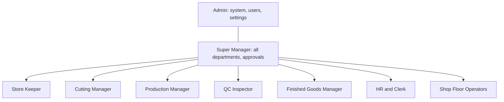
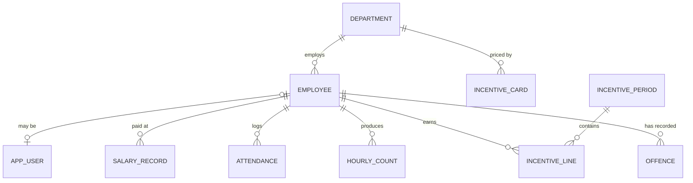
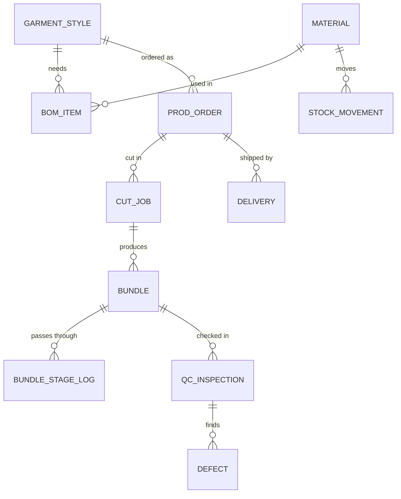
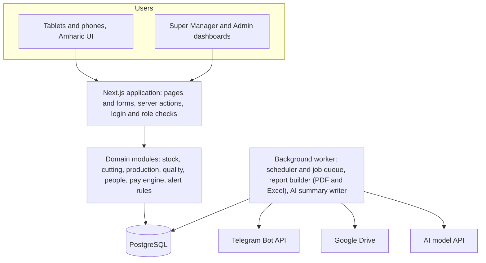
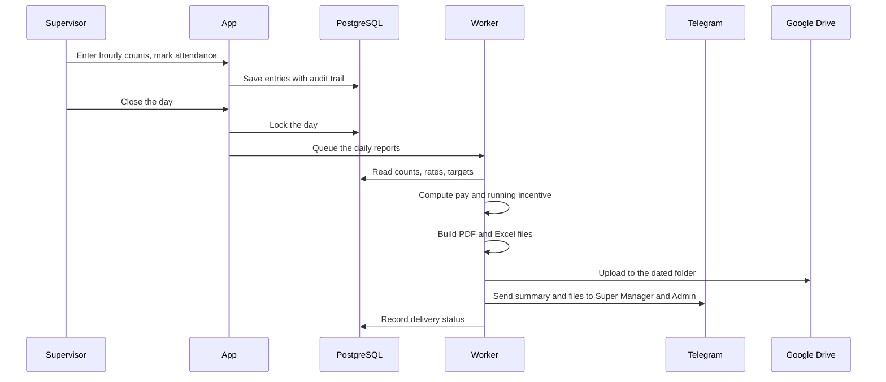
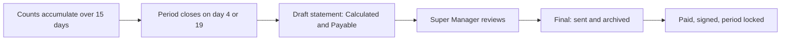

# Garment production and incentive system

## Master plan, business rules, architecture and delivery plan

A tablet-first system, entirely in Amharic, that follows garments from raw fabric to delivery, pays a fixed salary plus a bi-weekly incentive for work over target, and sends management the same tables they read today, automatically, by Telegram and Google Drive.

**Version 2.0 (revised), September 20, 2026.** Based on the client's requirement notes, the two sample files (salary_schedule.pdf and incentive_v4.pdf) and the decisions made after version 1: a Super Manager and an Admin, fixed salaries, and incentive only for work over target. This document contains no code. It explains what is being built, how it behaves and why.

## The nine stages

| 1 | 2 | 3 | 4 | 5 | 6 | 7 | 8 | 9 |
|---|---|---|---|---|---|---|---|---|
| Receiving | Cutting | Sewing | Trimming | Quality control | Styling, hit press | Ironing | Packing | Delivery |
| ጥሬ እቃ መቀበያ | ቆረጣ | ስፌት | ለቀማ | ጥራት ቁጥጥር | ሂትፕረስ | ካውያ | ማሸግ | ማድረስ |

Stages 2 to 8 are the ones where workers can earn an incentive for work over target. Stages 1 and 9 are tracked but carry no incentive.

## Contents

1. What you are building
2. What the two PDFs show
3. How the factory flows
4. Roles and permissions
5. Business rules
6. Data model
7. System architecture
8. Automation and reports
9. Screens by role
10. Roadmap and testing
11. Risks
12. Recommendations
13. Open questions
14. Glossary
- Appendix: sample reference values

---

## What changed in version 2

Version 2 applies the decisions made after version 1 was reviewed. Everything else from version 1 remains, except where these decisions made a rule obsolete.

| Decision | What it means for the system | Where |
|---|---|---|
| One Super Manager and one Admin control everything | Two top-level roles replace the single Admin/Owner. The Super Manager manages all department roles and approves pay. The Admin controls users, settings and the system. There are now nine roles. | Chapter 4 |
| Salary is fixed, not paid per piece | The wage piece rate and the daily piece-rate pay are removed. Every employee has a fixed salary. The daily salary schedule becomes a daily production sheet (no pay columns) plus a monthly fixed salary schedule. | 2.1, 5.3, chapter 8 |
| Incentive is paid only for work over target | The incentive card (target per hour and rate per piece) is the only rate table. The payable incentive is never below zero and nothing is deducted from the fixed salary. | 5.4 |
| Everything else remains | Nine stages, wastage alerts, penalty ladder, Telegram and Drive automation, Amharic interface, architecture and roadmap stay, apart from wording that followed from the three decisions above. | Chapters 3, 5 to 10 |
| New in this version | A recommendations chapter with 22 items. The open questions are rewritten: two old questions are settled by the decisions above, and new ones cover the fixed salary, shortfalls and the Super Manager and Admin split. | Chapters 12, 13 |

> **Two interpretations to confirm.** First, I read "incentive when work is over target" as: a shortfall never reduces pay, and the payable incentive is never below zero (Q2). Second, I gave the Super Manager the approval of pay and the Admin the control of the system, with both able to see and act on everything (Q11).

---

## 1. What you are building

The factory turns fabric into T-shirts and trousers in nine stages. The numbers behind that work (who sewed how many pieces, what incentive each person earned, how much fabric was wasted, what is in stock) are recorded on forms like the two sample PDFs. The system replaces those forms with tablet entry, does the arithmetic itself, and sends finished tables to management.

### The three jobs of the system

1. **Record** what happens at every stage, by the person who does it, on a tablet or phone, in Amharic.
2. **Calculate** what the records mean: the incentive for work over target, the penalty rules, and fabric wastage.
3. **Deliver** alerts, the Amharic daily summary and the pay tables to management on Telegram, and archive every file in Google Drive, without anyone building a report by hand.

### How people are paid

Every employee has a fixed salary that does not depend on how many pieces they make. On top of it, an employee can earn an incentive for pieces above the daily target, calculated over 15-day periods. This one fact drives much of the design: production counts matter because they decide the incentive, not the salary.

### Goals

- One system for stock, cutting, production, quality, finishing and delivery.
- Incentive outputs that reproduce incentive_v4.pdf to the cent. The samples double as acceptance tests (chapter 10).
- Every screen, message and report in Amharic, usable on shop-floor tablets and smartphones.
- Full control for one Super Manager and one Admin, with a clear trail of who changed what.
- Simple enough that one developer can build, run and hand it over.

### Scope

**In scope**

- Stages 1 to 9 tracking, by bundle
- Nine user roles, including a Super Manager and an Admin
- Employee list with fixed salaries, attendance and line assignment
- Hourly piece counts per worker
- Bi-weekly incentive statements, penalty ladder, monthly summary and chart
- Daily production sheet and monthly fixed salary schedule
- Fabric wastage calculation and alerts
- Stock levels and low-stock alerts
- Four core reports plus the Amharic daily summary
- Telegram delivery and Google Drive archive
- Barcode or tag for finished goods
- Audit log and backups

**Out of scope**

- Live truck tracking. Delivery records what left, not where it is.
- Accounting and invoicing
- Tax, pension, overtime and absence deductions, unless the client asks (Q1)
- Purchase orders and supplier payments
- Customer portal

Items in the out-of-scope list are not in the requirement notes. They can become later phases, but they are not planned here.

### How big is it?

The samples describe about 56 to 67 workers and 9 system users. If every worker gets an hourly count for 8 hours, that is roughly 540 count cells per day. This is a small data problem: one PostgreSQL database on modest hardware is more than enough. The hard part is not volume. It is getting the incentive rules exactly right and making entry fast enough that supervisors prefer it to paper.

> **How to read this document.** Chapters 2 and 5 are the core: what the PDFs say and the rules the system must obey. Chapters 6 and 7 are the technical design. Chapter 12 gives recommendations and chapter 13 lists the questions to settle with the client before the pay engine is built.

---

## 2. What the two PDFs show

These two files are the specification for the most important outputs. Everything in this chapter was read out of them. I recomputed every row: each salary line equals produced pieces × piece rate, and each incentive line equals (+ − − − 2 × mistakes) × rate. Nothing in the samples contradicts the formulas. Because version 2 makes the salary fixed, the salary file is now mainly a source of layout, operations, machines and targets, and the incentive file is the source of the pay rules.

### 2.1 salary_schedule.pdf: the daily register, now without pay

Title: **የሰራተኞች ደሞዝ ሰሌዳ** (Employee Salary Schedule), a daily register that paid workers by piece rate. With a fixed salary, the pay columns go away, but the sheet remains valuable as the daily production record: one sheet per day, 56 workers in 13 operations, over two printed pages.

| Keep | Drop | Add |
|---|---|---|
| Header: date (Ethiopian calendar, sample 2018/12/15), shift, supervisor, manager. Columns: serial number, name, operation, machine type, daily target, produced, signature. Rules: daily target = hourly target × 8 hours; rework pieces are not counted. | The piece rate column, the daily pay column, and the formula "daily pay = produced × piece rate". | Difference against target (+ or −) and percent of target for each worker, because the incentive is built on these. |

> **Daily difference = pieces produced − ( hourly target × hours worked )**
>
> A full shift is 8 hours. Helpers have no target on this sheet.

Structure of the sample day, with figures I calculated from the rows:

| # | Operation | Machine | Workers | Target per day (per hour) | Produced | At or above target |
|---|---|---|---|---|---|---|
| 1 | Cutting and preparation, helpers (ቆረጣ እና ዝግጅት) | Cutter or helper | 5 | 520 (65) | 2,622 | 3 of 5 |
| 2 | DTF sticker heat-pressing | Hitpress | 4 | 656 (82) | 2,656 | 3 of 4 |
| 3 | Pocket sewing and topstitch (ኪስ መስፋት + ደርዝ) | Single needle | 3 | 440 (55) | 1,348 | 3 of 3 |
| 4 | Neck rib and back tape | Single needle | 2 | 656 (82) | 1,331 | 1 of 2 |
| 5 | Waistband and elastic joining | Single or overlock | 3 | 440 (55) | 1,331 | 3 of 3 |
| 6 | Waist, Kanshay (ወገብ በካንሻይ መምታት) | Kanshay | 1 | 1,304 (163) | 1,299 | 0 of 1 |
| 7 | Trouser panel seam, front and back | Overlock | 2 | 656 (82) | 1,337 | 2 of 2 |
| 8 | Shoulder and sleeve joining | Overlock | 6 | 440 (55) | 2,672 | 4 of 6 |
| 9 | T-shirt and trouser side seam | Overlock | 8 | 328 (41) | 2,674 | 6 of 8 |
| 10 | T-shirt and trouser hem or sleeve fold | Interlock | 4 | 328 (41) | 1,342 | 3 of 4 |
| 11 | Line material feeder or helper | Helper | 3 | none | none | none |
| 12 | Thread trimming (ክር ለቃሚ) | Trimmer | 11 | 240 (30) | 2,718 | 9 of 11 |
| 13 | Ironing and packing (ካውያ እና ማሸግ) | Kawya | 4 | 328 (41) | 1,349 | 3 of 4 |
| | **Total** | | **56** | | **22,679** | **40 of 53** |

> **Two follow-ups.** The fixed salary schedule has no sample yet, so its layout is unknown: ask the client for one (Q1). The old note about different T-shirt and trouser piece rates on operations 8, 9 and 10 was about wages; whether incentive rates also differ by garment is Q13.

### 2.2 incentive_v4.pdf: the bi-weekly incentive statement

This is a multi-part document. Each part becomes a screen, a report, or both. Its own rules page says the incentive is paid separately from the monthly salary, which matches the fixed-salary decision.

1. **Rules page.** The special note that incentive is paid separately from the monthly salary; the two pay dates (day 4 and day 19); the formula; motivational lines for workers; and the four-step penalty ladder.
2. **Rate card.** 21 rows: department, machine type, hourly target and incentive rate per piece (ሳንቲም, in ETB). Now the only rate table. Reproduced in the appendix.
3. **Statement for day 4.** 67 workers. Columns: serial, name, department, machine, rate, +pieces, −pieces, mistakes (×2), incentive (ETB), signature. Header: ኢንሴንቲቭ ክፍያ - ቀን 4, counting period from day 20 of the previous month to day 4. Total 3,880.50 ETB.
4. **Statement for day 19.** Same layout. Counting period day 5 to day 19. Total 3,765.00 ETB.
5. **Daily piece-count form.** The blank sheet supervisors fill: date, supervisor, department, target per hour, eight hourly columns, daily +/−. It feeds the incentive statement. This is what the tablet screen replaces.
6. **Monthly summary and chart.** 24 departments with day-4 total, day-19 total and month total, plus a bar chart of monthly incentive by department. Grand total 7,645.50 ETB.

> **Calculated incentive (ETB) = ( +pieces − −pieces − 2 × mistakes ) × rate per piece**
>
> In the sample, negative results are printed as negative numbers. Version 2 adds a Payable amount that is never below zero (section 5.4).

**Worked lines from the sample**

| Worker and department | Rate | + | − | Mistakes | Calculation | Calculated | Payable |
|---|---|---|---|---|---|---|---|
| Senait Teferi, Overlock, shoulder (period 1) | 1.00 | 200 | 0 | 0 | (200 − 0 − 0) × 1.00 | 200.00 | 200.00 |
| Sewnet Kabhun, Interlock hem (period 1) | 1.20 | 100 | 0 | 0 | (100 − 0 − 0) × 1.20 | 120.00 | 120.00 |
| Shewaye Shimeles, pocket attaching (period 1) | 0.90 | 0 | 30 | 0 | (0 − 30 − 0) × 0.90 | −27.00 | 0.00 |
| Constructed example, because the sample column is always 0 | 0.90 | 200 | 20 | 5 | (200 − 20 − 10) × 0.90 | 153.00 | 153.00 |

**Penalty ladder printed on the rules page**

1. **First offence:** twice the mistaken count is deducted from the incentive.
2. **Second offence:** incentive is fully suspended for two months.
3. **Third offence:** written warning and disciplinary action on the job.
4. **Fourth offence:** action up to termination under company regulations.

> **My reading of "ማሳሳት" (mistake).** The rules page says accuracy of numbers is the basis of trust, so I read a "mistake" as a piece count that was reported wrongly (false or miscounted), not a sewing defect. This is a guess to confirm. See Q6.

### 2.3 What the two PDFs still disagree on

The two files do not describe the same list of people or the same targets. The system must handle both without forcing them together.

| Topic | salary_schedule.pdf | incentive_v4.pdf | Consequence |
|---|---|---|---|
| People | 56 names | 67 names, different names | One employee master. Each person belongs to one department. The samples are probably from different files, so nothing can be merged by name. |
| Grouping | 13 operations | 21 rate rows, 24 summary departments | Two classification schemes. A mapping between them is needed (Q3). |
| Target | Hit press 656 per day (82 per hour), ironing and packing 328 (41) | Hit press 90 per hour, ironing 45, packing 55 | Targets differ for the same work. Version 2 uses the incentive card as the single source (Q3). |
| Rhythm | Daily | Every 15 days, days 4 and 19 | A daily production sheet plus period statements. |
| Ironing and packing | One combined operation | Two departments | Departments must be finer-grained than operations. |

A few decorative banner lines on the incentive rules page did not extract legibly from the file, so I did not rely on them. If they contain rules, send the original wording.

---

## 3. How the factory flows

A cut bundle is the unit that travels. Workers' counts are recorded separately per person per hour, because the incentive is calculated from them. Both views matter: bundles show where work is, counts show who did it and what they earn.


Stages 2 to 8 earn an incentive. Stages 1 and 9 do not.

| # | Stage | Who records | What is recorded | Result | Earns incentive? |
|---|---|---|---|---|---|
| 1 | Raw material receiving | Store Keeper | Scan or enter arrival: material, supplier, lot, quantity, unit. The system assigns the SKU. | Stock updated. Low-stock check. | No |
| 2 | Issue and cutting | Cutting Manager (requests), Store Keeper (issues) | Fabric requested per order. After cutting: total weight used, pieces cut, bundles created. | Wastage % calculated at once. Alert above 5%. Bundles released to sewing. | Yes |
| 3 | Sewing | Operators and Production Manager | Bundles arrive at lines. Hourly piece counts per worker. | Live progress for management. | Yes |
| 4 | Trimming (ለቀማ) | Supervisor | Pieces trimmed per worker. | Bundle moves on. | Yes |
| 5 | Quality control | QC Inspector | Inspect, pass or fail, defect reason, responsible operation. | Passed items go to the finished-goods staging queue. Defective items are scanned and sent back to the specific line for repair. | Yes |
| 6 | Styling, hit press | Supervisor | Pieces pressed per worker. | Bundle moves on. | Yes |
| 7 | Ironing (ካውያ) | Supervisor | Pieces ironed per worker. | Bundle moves on. | Yes |
| 8 | Packing (ፓኪንግ በማዳበሪያ) | Supervisor or Finished Goods Manager | Pieces packed into bags per worker. | Finished goods ready. | Yes |
| 9 | Delivery | Finished Goods Manager | Quantity dispatched, customer, date, tag or barcode. | Order status updated. No live truck tracking. | No |

> **Order of stages.** As listed, quality control (5) comes before styling, ironing and packing (6 to 8). Many factories inspect again at the end. The system should not hard-code the order: each style gets an ordered route of stages, defaulting to the nine above, so a style without hit press, or with a final check, needs no redesign. See Q10.

### Which incentive departments belong to which stage

The incentive rate card is finer than the nine stages. This is my reading of how its departments map to stages (English names are approximate; the Amharic terms are authoritative).

| # | Stage | Departments on the rate card | Workers in sample |
|---|---|---|---|
| 2 | Cutting | ቆራጭ cutter (1), ረዳት ቆራጭ assistant cutter (1), ስቲከር / ላስቲክ መቀጥ sticker and elastic cutting (1), ረዳት / ሱሪ መቁረጥ helper, trouser cutting (1) | 4 |
| 3 | Sewing | ትከሻ (በክ) ፍሬንት shoulder back and front (4), ወገብ መቀምቀም waist tacking (1), እጅ / ሳይድ sleeve and side (4), ኪስ መለጠፍ pocket attaching (4), ሳይድ side (4), እጃት sleeve (4), እጅት ደርዝ እና ባጅ sleeve topstitch and badge (2), Interlock ማጠፍ interlock hem (4), ወገብ መቀጠም waistband joining (4), የካንሻይ ወገብ ዝግጅት Kanshay waist prep (3) | 34 |
| 4 | Trimming | ቅንጫባ (ክር ለቃሚ) thread trimming (8) | 8 |
| 5 | Quality control | Quality inspector (1), ዳሜጅ / ሱሪ መስረት damage and repair (2) | 3 |
| 6 | Styling | ሂትፕረስ መለጠፍ heat-press applying (4) | 4 |
| 7 | Ironing | ካውያ ironing (4) | 4 |
| 8 | Packing | ማሸግ packing (5) | 5 |
| | Support | የመስመር ረዳት line helpers (2), ረዳት helper (1), መስመር ማሰራት line running (1), ማሰራት / ቁጥጥር line control (1). Target 0, so their incentive is always 0. | 5 |
| | **Total** | | **67** |

---

## 4. Roles and permissions

The client asked for at least eight roles and, in version 2, for two people at the top: one Super Manager who manages all the other roles, and one Admin. Both control everything. The other seven roles come from the requirement notes. The permission table is configuration, not code, so it can be adjusted later.



The Admin and the Super Manager are the top level, with full access.

| Role | Amharic | Main duty |
|---|---|---|
| Admin | አስተዳዳሪ | Controls the system: creates users, assigns roles and permissions, sets alert rules and connections (Telegram, Google Drive), runs backups and reads the audit log. Can correct locked data, with a required reason. |
| Super Manager | ሱፐር ማኔጀር (ዋና ሥራ አስኪያጅ) | Manages all the other roles and departments. Sees every screen and report, approves incentive statements, salary schedules and salary changes, sets targets and incentive rates, and receives all Telegram reports and alerts. |
| Store Keeper | የመጋዘን ኃላፊ | Records material in and out and reports stock levels. |
| Cutting Manager | የቆረጣ ኃላፊ | Requests fabric, records weight used, pieces cut, bundles and wastage. |
| Production Manager | የምርት ኃላፊ | Follows sewing and the daily target, verifies counts. Likely the same person as the "supervisor" on the forms (Q12). |
| QC Inspector | የጥራት ተቆጣጣሪ | Checks quality, identifies defects, sends repairs back. |
| Finished Goods Manager | የተጠናቀቀ እቃ ኃላፊ | Receives finished garments, tags them, dispatches to customers. |
| HR / Clerk | የሰው ሀብት / ጸሐፊ | Employee records, attendance hours, line assignment. |
| Shop Floor Operator | የስራ ቦታ ኦፕሬተር | Reports daily work quantity by tablet or smartphone. |

### The two top roles side by side

Both roles can open every screen and act in any department, and every such action is marked "entered by manager" in the audit log. What differs is who holds which key. These are my defaults, to confirm in Q11.

| Topic | Admin | Super Manager |
|---|---|---|
| Purpose | Keep the system running, secure and correctly configured. | Run the business through the department roles. |
| Users, roles, permissions | Creates and changes them. | Views them. |
| Targets, incentive rates, fixed salaries | Can edit, but each change notifies the Super Manager. | Sets and approves them. |
| Approve incentive statements and salary schedules | Views. | Approves. Nobody else can. |
| Correct locked data | Yes, with reason. Pay-related corrections notify the Super Manager. | Yes, with reason. |
| Connections, backups, settings | Controls. | Views the audit log and reports. |
| Telegram | Receives summary, alerts, pay files and system errors. | Receives summary, alerts and pay files. |

### Permission matrix

V = views, E = views and edits, A = views, edits and approves or corrects after lock. Blank = no access. Checks happen on the server for every request, not only by hiding buttons.

| Function | Admin | Super Mgr | Store | Cutting | Prod. Mgr | QC | Fin. Goods | HR | Operator |
|---|---|---|---|---|---|---|---|---|---|
| Users, roles, permissions, settings, connections, backups | A | V | | | | | | | |
| Employee master (without salary) | E | A | | | V | | | E | |
| Fixed salary amounts | E | A | | | | | | | |
| Incentive card: targets and rates | E | A | | | V | | | | |
| Material receiving, stock issue | E | E | E | E* | V | | | | |
| Cut records and wastage | E | E | V | E | V | | | | |
| Bundle progress through stages | E | E | | V | A | V | V | | E |
| Hourly worker counts | E | A | | | A | | | V | E** |
| Attendance and line assignment | E | E | | | V | | | E | V |
| QC inspections and defects | E | E | | | V | E | V | | |
| Finished goods and delivery | E | E | | | V | V | E | | |
| Incentive adjustments, mistakes, offences | E | A | | E*** | E*** | E*** | | | |
| Approve incentive statements and salary schedules | V | A | | | | | | | |
| Dashboards and reports | V | V | V | V | V | V | V | V | |
| Audit log | V | V | | | | | | | |

- \* Cutting Manager creates fabric requests; the Store Keeper fulfils them.
- \*\* Operator entries stay "pending" until the supervisor verifies them. The person whose incentive depends on a count should not be its only source.
- \*\*\* Only for their own departments (for example, Cutting Manager for cutters). The client's notes say the admin or the department role enters + and −. The Super Manager approves before the statement is final.

> **Two keys on money.** Whoever enters a count does not verify it, and whoever verifies it does not approve the statement: supervisor enters, Production Manager verifies, Super Manager approves. Fixed salaries are visible only to the Super Manager and the Admin. HR sees attendance but not salary unless the client decides otherwise (Q15).

Every user sees only their own role's screens, in Amharic. Shared tablets use a short login (employee ID plus PIN) with automatic sign-out after inactivity.

---

## 5. Business rules

This chapter is the contract for the calculation module. Each rule includes a worked example so it can become an automated test. Where the PDFs do not settle a rule, a flag points to the open question and the default I would build.

### 5.1 Cutting wastage

> **Wastage % = ( weight used − pieces cut × standard weight per piece ) ÷ weight used × 100**
>
> Standard weight per piece comes from the style's bill of materials. Calculated the moment the Cutting Manager saves the cut record.

Example: 100.0 kg used, standard 0.250 kg per piece, 376 pieces cut. Standard weight = 94.0 kg, waste = 6.0 kg, wastage = **6.0%**. That is above 5%, so a Telegram warning is sent at once. The 5% limit is a setting, per style if needed.

> **Confirm the method (Q9).** The notes say the manager enters weight used and pieces cut. That only yields a wastage figure if a standard weight per piece exists. If the client instead weighs leftover offcuts, the formula changes to offcut weight ÷ weight used.

### 5.2 Targets, hours and hourly counts

- Each worker has an hourly target from the incentive card of their department.
- Daily target = hourly target × hours worked. A full shift is 8 hours, as the salary schedule states. Attendance provides the hours (example: 5 hours worked at 82 per hour gives a target of 410).
- Supervisors enter the number of pieces per hour (columns hour 1 to hour 8 on the paper form). The system derives the difference against target per hour and per day.
- Daily difference is positive or negative. It feeds the period's **+ pieces** or **− pieces**.

> The paper form does not show whether the hourly cells hold actual pieces or differences. Entering actual pieces is safer and removes hand arithmetic. Confirm in Q4, and confirm the absence rule in Q5.

### 5.3 Fixed salary

> **Salary = a fixed amount per employee**
>
> It does not change with the pieces produced. Production only affects the incentive.

- Each employee has one fixed salary amount with an effective date. Changes keep history, so an old month always shows what was true then.
- Only the Super Manager and the Admin can see or change salaries. The Super Manager approves changes; any Admin change sends a notice to the Super Manager.
- The monthly fixed salary schedule lists name, department, fixed salary, days attended (from attendance, for reference) and a signature column. Its final layout needs a sample from the client.
- Not calculated unless the client asks: tax, pension, overtime and deductions for absence.

> Version 1 left base payroll out of scope. Printing a fixed amount is easy; any calculation beyond that adds rules and legal duties. Confirm in Q1.

### 5.4 Incentive for work over target

> **Calculated = ( total +pieces − total −pieces − 2 × mistakes ) × incentive rate**
>
> **Payable = the larger of 0 and Calculated, and 0 during a suspension**
>
> Only work over target earns money. A shortfall never reduces the fixed salary.

- Accumulated over a 15-day counting period and paid on day 4 and day 19.
- Only first-time-good pieces count. Rework, and pieces QC has rejected, are excluded until repaired (Q14).
- Each statement prints two columns per worker: **Calculated** exactly as in the sample, negatives included, and **Payable**. The month summary and its chart use Payable.
- Each line is rounded to two decimals, then the period total is the sum of the printed lines. In the sample, totals equal the sum of the lines exactly.
- Money is stored as exact decimals, never as floating-point numbers, so cents never drift. The rate used on each line is copied onto it when the period closes, so later rate changes never alter old statements.

**Sample totals**

| | Period 1 (day 4) | Period 2 (day 19) | Month |
|---|---|---|---|
| Pieces above target (+) and below (−) | +4,865 and −430 | +4,610 and −270 | |
| Calculated (as printed in the sample), ETB | 3,880.50 | 3,765.00 | 7,645.50 |
| Payable (negatives as 0), ETB | 4,243.50 | 4,009.00 | 8,252.50 |

Flooring at zero raises the sample month by 607.00 ETB, about 7.9%. The Super Manager should see this cost before approving the rule (recommendation R3).

**Netting or surplus only (Q2).** In the sample, no worker has both + and − in the same period, so netting and surplus-only give the same totals there. They differ when a worker has a good day and a bad day in the same period. Example at rate 0.90: +200 on one day and −100 on another. Netting pays (200 − 100) × 0.90 = 90.00. Surplus-only pays 200 × 0.90 = 180.00. Default: net per period, as the sheet's formula does, then floor at zero.

### 5.5 Penalty ladder in the system

| Offence | Rule from the sheet | What the system does |
|---|---|---|
| 1st | 2 × the mistaken count deducted from incentive | Automatic through the mistakes term in the formula. It reduces the incentive only, never the fixed salary. The offence is recorded with reason, date and who entered it. |
| 2nd | Incentive suspended for 2 months | Creates a suspension with start and end dates (two months, about four pay periods). Earned amounts still print but are marked suspended and payable 0. |
| 3rd | Written warning and action on the job | Opens an HR case and notifies the Super Manager and Admin. No automatic pay effect. |
| 4th | Action up to termination by regulation | Opens an HR case and notifies the Super Manager and Admin. No automatic pay effect. |

The system records and recommends. People decide anything beyond the incentive amount. See Q7 for how offences are counted over time and Q6 for what a mistake is.

### 5.6 Pay calendar

Ethiopian months have 30 days, except Pagume, which has 5 or 6. Period 1 runs from day 20 of the previous month to day 4 (11 + 4 = 15 days). Period 2 runs from day 5 to day 19.

**Edge case:** for Meskerem the previous month is Pagume, which has no day 20. Period boundaries therefore live in configuration per month, not in a fixed formula (Q8).

The system stores dates in one standard form and converts to the Ethiopian calendar for screens, reports and period logic. Time zone is East Africa Time (UTC+3, no daylight saving).

### 5.7 Alerts

| Alert | Trigger | Goes to | Repeat rule |
|---|---|---|---|
| Low stock | On-hand quantity at or below the material's minimum level | Super Manager, Admin, Store Keeper | Once per day until restocked |
| Wastage | Cut job wastage above the limit (default 5%) | Super Manager, Admin, Cutting Manager, Production Manager | Immediately, once per cut job |
| Delayed order | Order behind its planned stage or past its due date | Super Manager, Admin, Production Manager | Daily until resolved |
| Report delivery failed | Telegram or Drive upload fails after retries | Developer chat, Admin | Each failure |
| Missing day close (suggested) | Day not closed by an agreed time | Supervisor, Super Manager | Once |
| Unusual count (suggested) | A worker's count far above target (for example, above 150%) | Supervisor | On entry, needs confirmation |

The last two are additions that protect incentive accuracy, since the incentive depends on counts.

### 5.8 Locking and corrections

- Count entries move through **draft, submitted, verified, locked**. Closing the day locks it.
- After a lock, only the Admin or the Super Manager can change data, with a required reason. The old value stays in the audit log with who, when, before and after. Corrections by the Admin to pay data also notify the Super Manager.
- If a correction changes a report already sent, a new version is generated and the Telegram message says it replaces the earlier one. File names carry a version suffix.
- An incentive period cannot be locked until the Super Manager approves the statement.

---

## 6. Data model

The data model is described in words and two relationship diagrams. The exact table definitions are a build-time task.

### People and pay



### Product and production



| Domain | Main records | Notes |
|---|---|---|
| People | User (login and role, including Super Manager and Admin), Employee (ID, name, department, status), Department, Attendance (date, in and out, hours, line, shift), Line assignment | An employee may or may not have a login. Operators log in with ID and PIN. |
| Salary | Salary record: employee, fixed amount, effective from and to | Field-level access: Super Manager and Admin only. History kept. |
| Incentive card | Department or operation, target per hour, incentive rate per piece, effective from and to | The only rate table. Effective-dated so last month's statement still uses last month's rates. |
| Materials | Material or SKU (type, unit, minimum level), Supplier, Lot, Stock movement (receive, issue, return, adjust) | Stock on hand is the sum of movements, so history is never overwritten. |
| Product | Style (name, size, color), Bill of materials, Order (customer, style, quantity, due date, route of stages) | Master data from the requirement notes: SKU, style, size, color, unit, unit price, lot number, supplier, BOM. |
| Production | Cut job (weight issued, weight used, pieces, wastage%), Bundle (ID, lot, size, quantity), Bundle stage log, Hourly count, Day close | Bundle logs give independent totals to check worker counts against. |
| Quality | QC inspection, Defect (type, responsible operation and worker, repair status) | Rework is tracked so it can be excluded from incentive counts. |
| Delivery | Finished item or tag, Delivery (order, quantity, date, customer) | No vehicle tracking. |
| Incentive | Incentive period, Incentive line (plus, minus, mistakes, rate copy, calculated amount, payable amount, status), Offence, Suspension | Statement versions are kept when corrected. Approval by the Super Manager is recorded. |
| Automation | Alert, Report file (type, period, Drive file, Telegram message, status, version), Recipient (Telegram chat and reports allowed), Setting | Report file rows also power a "delivery status" screen. |
| Control | Audit log (who, when, what, before, after, reason, acted as manager or not) | Append-only. |

### Design rules

- Never hard-delete business records. Mark them inactive.
- Every changeable value that affects money is dated and traceable.
- Client-generated IDs on entries, so a retried submission from a tablet never creates a duplicate.
- Reconciliation check: total of worker counts for a department vs the pieces logged for bundles at that stage. Large gaps are flagged, which also supports the "mistake" rule.

---

## 7. System architecture

### 7.1 Approach

A **modular monolith**: one Next.js application containing the user interface and the server logic, one PostgreSQL database, and one small background worker for scheduled and heavy jobs. Modules are separated inside the codebase (stock, cutting, production, quality, people, pay engine, alerts, reports) but deployed as a single unit. For a team of one, this is easier to build, test, host and hand over than separate services, and the data volume does not need more.



### 7.2 Technology choices

| Layer | Choice | Why | Watch out for |
|---|---|---|---|
| App and API | Next.js with TypeScript | One framework for screens and server logic, as the client's stack notes specify. | Keep business rules in plain modules, not inside page components, so they can be tested alone. |
| UI | Tailwind CSS and shadcn/ui, Recharts for graphs, installable web app (PWA) | Responsive on tablets and phones. Recharts draws the department bar chart. | Large touch targets, number keypad inputs, high contrast for workshop light. |
| Database | PostgreSQL with Prisma | Reliable relational storage and safe migrations. | Use exact decimal types for money and quantities. |
| Login | Auth.js with username and PIN, or a hosted provider such as Clerk | Workers have no email, so credentials login fits. Hosted auth is quicker to start but adds a vendor and possible cost. | PIN rules, lockout after failed attempts, sign-out on shared tablets. |
| Background jobs | A worker process with a Postgres-backed queue, or platform cron plus a report outbox table | Daily close, period close, retries. | Serverless platforms limit run time and cron frequency. |
| PDF and Excel | HTML-to-PDF with a headless browser, or a PDF library; a spreadsheet library for Excel | The sample layouts are wide tables with Amharic text. | Embed an Ethiopic font in every PDF. A headless browser gives the best layout fidelity but needs a host that can run it. |
| Notifications | Telegram Bot API | Free, works on phones, supports files. | Bot messages are not end-to-end encrypted. Message length limit about 4,000 characters. File size limit about 50 MB. |
| Archive | Google Drive API with narrow, per-file access | Client already uses Drive. Owner can browse the archive. | Service-account files are owned by that account; owner-authorized access counts against the owner's storage. Choose deliberately. |
| AI | A hosted language model (a free tier such as Gemini is enough to start) | Writes the Amharic summary and plain-language warnings. | See 7.7: it writes words, it never does arithmetic. |

### 7.3 Hosting options

Prices change often, so this compares technical fit only. Cost comparison belongs in the client-facing cost document.

| Option | Good for | Watch out for |
|---|---|---|
| A. Managed platform (for example Vercel) with a managed PostgreSQL | Fastest start, low ops effort. | Function time limits and cron limits, running a headless browser for PDFs, terms that may forbid commercial use on free plans, data outside Ethiopia, latency. |
| B. One virtual server abroad running containers (app, database, worker) | Cron, PDF generation and queue in one place. Predictable behavior. | You handle updates, backups and security. Latency to Addis Ababa. |
| C. Ethiopian cloud or hosting provider | Local payment, data in the country, lower latency. | Verify Node.js, containers, PostgreSQL, backups, and stable outbound access to Telegram and Google before committing. |
| D. Small server inside the factory | Keeps working on the local network during internet outages. | Needs power backup, physical security, remote access and someone to maintain it. |

> **Recommendation.** Build everything as containers so the host can change later. Start on B or C. Before choosing, test from the candidate host that api.telegram.org and Google APIs are reachable reliably, because the automation depends on them.

### 7.4 One day through the system



### 7.5 Incentive period lifecycle



If the reviewer finds a problem, the statement goes back for a correction with a reason and returns for review.

### 7.6 Amharic and Ethiopian-calendar requirements

- **Strings:** all screen text lives in a translation file, never hard-coded, and follows the glossary in chapter 14 so the same term is used everywhere.
- **Fonts:** an Ethiopic font (such as Noto Sans Ethiopic) in the UI and embedded in every PDF. Test full character coverage on real names.
- **Calendar:** an Ethiopian-calendar date picker; conversion at the edges only; unit tests around Pagume, leap years and period boundaries.
- **Numbers:** Arabic digits, as in the samples (confirm in Q15).
- **Sorting and search:** Amharic-aware ordering and search by any part of a name.
- **Telegram tables:** Ethiopic characters do not align in monospace text, so tables are sent as PDF or Excel files and the message stays a short summary.

### 7.7 AI for the daily summary

- The system computes every number first. The model receives a structured set of facts and only writes the Amharic narrative.
- The output is checked: every number in the text must match the facts. If the model fails or a number does not match, a fixed Amharic template is sent instead.
- Send aggregates, not employee names or wages, to the outside model unless the client agrees otherwise.
- Keep prompts and outputs logged. A person reviews the wording during the first weeks. The model provider stays replaceable.

### 7.8 Reliability

- **Connection and power:** entries are saved as drafts on the device immediately and retried automatically. Full offline queueing arrives in phase 3. Plan a charging station and backup power for the router.
- **Delivery outbox:** every report is a row with status (pending, sent, failed) and retries with backoff. If Telegram or Drive is down, nothing is lost and the Super Manager or Admin can download from the app.
- **Backups:** nightly encrypted database dump to a second location, plus a monthly restore test. A backup never restored is not a backup.
- **Monitoring:** a health check and a message to a developer chat when jobs fail.

### 7.9 Security and privacy

Salary and incentive data is sensitive, and fixed salaries most of all. They are visible only to the Super Manager and the Admin, with field-level checks on the server. Salary and incentive files go only to their Telegram chats, which are bound to their accounts with a one-time code. The bot ignores every other chat.

Telegram bot chats are not end-to-end encrypted. If that is a concern, send a summary with a Drive link and keep full statements and salary files in a private Drive folder only.

Admin and Super Manager actions on other departments' data are marked in the audit log. Admin changes to salaries, targets or incentive rates notify the Super Manager.

Role checks on the server, least-privilege access to Drive, secrets in environment variables, HTTPS only, database not exposed to the internet, encrypted backups.

Collect only the employee data the system needs, and follow local data-protection rules for notice and consent.

---

## 8. Automation and reports

Every report is generated by the worker, sent to Telegram, saved to Google Drive and recorded in the database, all from one job.

| Report | Trigger | Content | Format | Telegram to |
|---|---|---|---|---|
| Daily Amharic summary | Day close, with a fixed-time fallback | Headline numbers, alerts, orders at risk | Message and PDF | Super Manager, Admin, department managers |
| Daily production sheet | Day close | Layout of salary_schedule.pdf without pay: target, produced, difference and percent of target per worker | PDF and Excel | Super Manager, Admin, Production Manager |
| Daily piece-count sheet | Day close | Eight hourly columns and daily +/− per worker | PDF | Super Manager, Admin, Production Manager |
| Running incentive | Day close | Period to date: +, −, mistakes, calculated and payable per worker | PDF and Excel | Super Manager, Admin only |
| Incentive statement | Period close, day 4 and day 19, after Super Manager approval | Layout of the incentive_v4.pdf statement pages, with Calculated and Payable | PDF and Excel | Super Manager, Admin only |
| Monthly incentive summary | After the day-19 statement | Department table and bar chart, using Payable | PDF | Super Manager, Admin only |
| Monthly fixed salary schedule | Month end, after Super Manager approval (date to be agreed) | Name, department, fixed salary, days attended, signature column | PDF and Excel | Super Manager, Admin only |
| Daily inventory report | Morning and day close | Stock by SKU, movements, items below minimum | PDF or Excel | Super Manager, Admin, Store Keeper |
| Cutting wastage report | Day close | Each cut job, wastage % against the limit | PDF | Super Manager, Admin, Cutting, Production |
| Employee productivity | Day close | Hours against output, efficiency against target | PDF | Super Manager, Admin, Production, HR |
| Order status | Day close and on request | Each order by stage, delays | PDF | Super Manager, Admin, Production |
| Instant alerts | On event | Stock, wastage, delayed order | Short text | By alert rule |

### Drive folder structure and file names

Folders follow the Ethiopian calendar because that is how the client reads dates: `Factory Reports / year / month / report type`. Salary and incentive folders are shared only with the Super Manager and the Admin. File names start with the date and are zero-padded so they sort correctly, for example `2018-12-15_daily-production-sheet_v1.pdf`. A regenerated report gets `_v2`, and the earlier file is kept.

### Telegram setup

Three destinations: a management chat for the Super Manager and the Admin (summary, alerts, salary and incentive files), a department managers' group (summary and alerts, no salary or incentive data), and a developer chat (system errors).

Each person links their Telegram account with a one-time code shown in the app. Recipients and the reports they may receive are managed by the Admin and visible to the Super Manager.

### Draft Amharic message templates

Wording for the client to review. Placeholders in braces are filled by the system.

```
⚠️ የብክነት ማስጠንቀቂያ
ትዕዛዝ: {order} ስታይል: {style}
የወጣ ጨርቅ: {kg} ኪ.ግ | የተቆረጠ: {pcs} ፍሬ
ብክነት: {pct}% (የተፈቀደ: 5%)
የቆረጣ ኃላፊ: {name}
```

```
📦 የክምችት ማስጠንቀቂያ
{material} ({sku}) ክምችት ከዝቅተኛ ወሰን በታች ነው።
ያለ: {qty} {unit} | ዝቅተኛ ወሰን: {min} {unit}
```

```
📊 የዕለት ማጠቃለያ - {date}
✂️ የተቆረጠ: {n} ፍሬ | ብክነት: {pct}%
🧵 የተሰፋ: {n} ፍሬ
✅ ጥራት ያለፈ: {n} | ❌ የተመለሰ: {n}
📦 የታሸገ: {n} | 🚚 የተላከ: {n}
🏆 ከዒላማ በላይ የሰሩ ሰራተኞች: {n} ከ {total}
⚠️ ማስጠንቀቂያዎች: {n}
```

The daily summary no longer shows a daily pay total, because salary is fixed. It shows how many workers finished above target instead. Incentive amounts are sent only in the Super Manager and Admin files.

---

## 9. Screens by role

| Role | Main screens | Design notes |
|---|---|---|
| Super Manager | Dashboard with graphs and profit and loss indicators, approval queue (incentive statements, salary schedules, salary and rate changes), every department screen, reports and delivery status | Approvals first. One tap to see what changed since the last period. |
| Admin | Users and permissions, settings and alert rules, Telegram and Drive connections, backups, audit log, corrections after lock | Every correction asks for a reason. Pay-related corrections show a notice that the Super Manager will be told. |
| Store Keeper | Receive materials (scan or enter, supplier, lot, quantity), issue to cutting against a request, stock levels with low-stock flags | SKU assigned by the system. Scan first, type last. |
| Cutting Manager | Fabric request, cut record (order, lot, weight used, pieces cut, bundles), wastage result | Wastage % appears instantly and turns red above the limit. |
| Production Manager | Live line board (bundles by stage), hourly count grid by department, day close, + and − adjustments, verification of operator entries, delayed orders | Grid of workers by 8 hours with a number pad, target prefilled, one tap to copy the previous hour. |
| QC Inspector | Scan bundle or garment, pass or fail, defect reason, responsible operation, send back to line | Three taps for a pass. Defect reasons come from a fixed list. |
| Finished Goods Manager | Staging queue, tag or barcode print, dispatch note | Order status updates automatically on dispatch. |
| HR / Clerk | Employee list (no salary), attendance and hours, line assignment | Bulk attendance for a whole line at once. |
| Shop Floor Operator | My work today, enter my count, bundle in hand | Very few fields, large buttons, drafts survive lost signal. |

**Rules for every screen:** Amharic only; numeric keypads for numbers; defaults instead of typing; confirmation before irreversible actions; drafts saved automatically; clear error messages that say what to do next.

---

## 10. Roadmap and testing

Three phases, ordered by dependency and by where the money is. Phase 1 replaces the paper forms that decide the incentive, because those outputs are already specified by the sample PDFs. If the client's requirements document defines its own phase boundaries, align these phases to them; the content stays the same.

| Phase | Content | Done when | Rough effort, one developer |
|---|---|---|---|
| 0. Confirm | Settle the open questions in chapter 13, collect a sample fixed salary schedule, the real incentive card and the employee list, agree the Amharic glossary. | Written answers to Q1 to Q15. | About 1 week |
| 1. Incentive and floor core | Login and the nine roles (including Super Manager and Admin), Amharic UI and fonts, Ethiopian calendar, employee and department master with fixed salaries, incentive card, attendance, hourly counts, day close, daily production sheet, incentive periods and statements (Calculated and Payable), penalty ladder, approval flow, monthly fixed salary schedule, monthly summary and chart, Telegram delivery, Drive archive, audit log, backups | Sample incentive statements reproduced exactly from entered data. One line piloted for a full month. | 5 to 7 weeks |
| 2. Materials to packing | Store keeper and stock, SKU and lots, BOM, cutting and wastage, bundles through all stages, QC and rework loop, alerts, four core reports, order status | A full order can be tracked from receiving to packing. | 6 to 8 weeks |
| 3. Insight and hardening | Finished goods and delivery, barcode and tags, dashboards and graphs, AI Amharic summary, delayed-order alerts, offline queue, load and user acceptance tests, training | Parallel run passes. Client signs off. | 4 to 6 weeks |

Effort figures are rough and depend on how quickly the client answers the open questions.

### Build order inside phase 1

1. Application skeleton, login, the nine roles and permission checks, Amharic strings, fonts and calendar conversion.
2. Departments, incentive card, employees and fixed salaries, loaded from the sample data.
3. Attendance and hourly count entry with day close.
4. Incentive engine as a standalone module of pure calculations, tested against the sample statements before any screen uses it.
5. PDF and Excel layouts that match the samples, plus the Payable column.
6. Approval flow, then Telegram and Drive delivery with the outbox and retry.
7. Audit log, locking, corrections, backups.
8. Pilot on one line with real supervisors.

### Acceptance tests taken from the samples

- **Daily production sheet:** each of the 53 workers with a target shows produced against target (for example 525 against 520 gives +5), the day totals 22,679 pieces and 40 of 53 workers are at or above target.
- **Incentive statements:** 67 rows per period; Calculated totals are 3,880.50 ETB (+4,865, −430) and 3,765.00 ETB (+4,610, −270), month 7,645.50 ETB; Payable totals are 4,243.50, 4,009.00 and 8,252.50 ETB.
- **Monthly summary:** the 24 department rows in the appendix, Calculated and Payable, including the negative department totals.
- **Fixed salary schedule:** layout agreed against a client sample once one exists.
- **Roles:** the Super Manager and the Admin can open every screen; only the Super Manager can approve a statement; department roles cannot see salaries; an Admin correction on pay data sends a notice to the Super Manager.
- **Wastage:** the 5.1 example gives 6.0% and triggers an alert; 5.0% exactly does not.
- **Amharic:** every PDF shows all characters correctly; a period spanning Pagume produces sensible boundaries.

### Rollout

- **Parallel run:** keep the paper forms for at least one full month (both pay periods) and compare totals per worker. Go live only when every difference is explained.
- **Training:** short sessions per role in Amharic, with a one-page guide per screen. Start with supervisors, since they enter the counts that decide the incentive.
- **Support:** a named contact and a fast way to report a wrong number during the first month.

---

## 11. Risks

| Risk | Why it matters | Response |
|---|---|---|
| Incentive rules unclear or changing | A wrong incentive destroys trust in the system. | Close the open questions first, keep rates and rules configurable, run in parallel with paper. |
| Only one Admin and one Super Manager | A lost phone, illness or resignation could lock everyone out, or leave one person with unchecked power. | Recovery codes held by the owner, a named deputy, two-key approval on money, audit log (recommendations R6 and R8). |
| Supervisors keep using paper | Data is incomplete. | Make entry faster than paper, print the familiar layouts, pilot on one line, train supervisors first. |
| Data-entry load (about 540 hourly cells per day) | Delays and typing errors. | Department grid, number pad, prefilled targets. If the client agrees, capture two or three checkpoints per day instead of hourly. |
| Incentive cost creeping up | Most sample workers finish above target, so cost can grow quietly. | Dashboard of share above target and incentive cost per 1,000 pieces; targets reviewed each quarter (R2). |
| Internet or power interruptions | Lost or late entries. | Drafts on the device, automatic retry, offline queue in phase 3, backup power for the router and tablets. |
| Amharic quality in PDFs and AI text | Broken glyphs or wrong wording. | Embedded fonts, PDF snapshot tests, template fallback, human review of AI text. |
| Scope creep toward a full ERP | Nothing gets finished. | Phases, out-of-scope list, written change requests. |
| Single developer | Client depends on one person. | Simple stack, containers, this documentation, a written runbook, tested backups, client-owned accounts. |
| Third-party limits or changes (Telegram, Google, AI free tier) | Reports could stop. | Outbox and retries, failure alerts, replaceable providers, download from the app as fallback. |
| Salary and incentive data exposure | Sensitive personal and financial information. | Field-level access, restricted chats and folders, encrypted backups, audit log (see 7.9). |

---

## 12. Recommendations

These are my recommendations across the whole project, from pay design to contracts. They are advice, not requirements: the client and you decide. Items are grouped by theme and marked with the moment they matter.

> **If you do only five things:** get written answers to Q1 to Q8 (R21); build and test the incentive engine against the sample statements before any screen (R10); use two keys on money (R6); protect fixed salaries above everything else (R7); run one full month in parallel with paper (R17).

### Pay and incentive design

| # | Recommendation | Why it matters | When |
|---|---|---|---|
| R1 | Pay incentive only on quality-passed pieces | With a fixed salary the incentive is the main lever. If rejected pieces count, speed will beat quality. Phase 1 relies on supervisors excluding known rework; Phase 2 ties counts to QC records per bundle. | Phase 1, then 2 |
| R2 | Review targets every quarter, with data | In the sample statements, 45 of the 61 workers who have a target finished period 1 above it, and 43 finished period 2 above it. That may mean the program works, or that targets are comfortable. Track the share above target and the incentive cost per 1,000 pieces, and change targets only at the start of a period. | Phase 1 dashboard |
| R3 | Show the cost of the "payable never below zero" rule before approving it | Flooring negatives at zero raises the sample month from 7,645.50 to 8,252.50 ETB, about 8% more. The Super Manager should see this number before choosing the rule. | Before build (Q2) |
| R4 | Consider a team bonus for support roles | Helpers, QC and line control have target 0, so they always earn 0 in the sample, even in a very good month. A line-level bonus tied to line output or QC pass rate is an option. It is the client's call. | Later |
| R5 | Let workers see and dispute their count | Show each worker their running incentive (client choice, Q15) and allow a short dispute window, for example 48 hours after the day closes and before the period locks. Most pay arguments are count arguments, and transparency prevents them. | Phase 1 |

### Control and security

| # | Recommendation | Why it matters | When |
|---|---|---|---|
| R6 | Use two keys on money | Supervisor enters, Production Manager verifies, Super Manager approves. The Admin may correct with a reason, and every Admin correction on pay data notifies the Super Manager. No one approves their own entries. | Phase 1 |
| R7 | Protect fixed salaries more than anything else | Field-level access (Super Manager and Admin only), never in group chats, private Drive folders, encrypted backups. Consider sending only a Drive link on Telegram for salary files. | Phase 1 |
| R8 | Plan for the one-Admin, one-Super-Manager setup failing | With one person per top role, a lost phone or a resignation locks everyone out. Keep sealed recovery codes with the owner, write a reset procedure, and name a deputy who can be promoted in an emergency. | Before go-live |
| R9 | Check counts against a second source | Compare each department's worker counts with bundle stage logs and QC results, flag large gaps, and audit a few workers each month. This is also how a "mistake" can be proven fairly. | Phase 2 |

### Build and technology

| # | Recommendation | Why it matters | When |
|---|---|---|---|
| R10 | Build and test the incentive engine first | Implement the calculation as isolated, pure functions and test it against the sample statements (appendix values) before any screen exists. If the numbers are right, everything built on them is safe. | Phase 1 start |
| R11 | Keep the first release small | Phase 1 is employees, attendance, counts, incentive, fixed salary schedule, Telegram and Drive. Pilot on one line for a full month before adding stock and cutting. | Phase 1 |
| R12 | Start with supervisor entry, add scanning later | Barcode scanning is more accurate but adds steps for workers. Introduce bundle scanning once the counts flow is trusted. | Phase 3 |
| R13 | Choose hosting after a reachability test | From each candidate host, confirm that Telegram and Google APIs are reachable reliably. Run everything in containers. Do not run the client's production system on a free plan whose terms forbid commercial use. | Before build |
| R14 | Design for weak internet and power | Drafts saved on the device, automatic retry, an offline queue in Phase 3, a small UPS for the router and a charging station for the tablets. | Phase 1 and 3 |
| R15 | Keep backups you have actually restored | Nightly encrypted dump to a second location, a monthly restore test on a fresh machine, and a written runbook. | Phase 1 |
| R16 | Have the client's Amharic speakers review the wording | Review the glossary, screen labels and Telegram templates with two or three staff. Keep the fixed-template fallback for the AI summary, and send only aggregate data to the AI service. | Phase 1 and 3 |

### Rollout, people and contract

| # | Recommendation | Why it matters | When |
|---|---|---|---|
| R17 | Run in parallel with paper for one full month | Compare per-worker totals for both pay periods. Go live only when every difference is explained. | Phase 3 (pilot earlier) |
| R18 | Train supervisors first and name a champion on the client side | Supervisors enter the counts that decide the incentive. One trusted person at the client answers daily questions and collects change requests. | Phase 1 |
| R19 | Check the physical setup early | Wi-Fi coverage on the floor, 8 to 10 inch tablets with rugged cases, chargers, and a safe place to leave them at night. | Before pilot |
| R20 | Put the client's name on every account | Hosting, domain, Google Drive, Telegram bot and code repository should belong to the client, with you as an authorised user. It avoids disputes at handover and lets the client continue if your availability changes. | Before build |
| R21 | Agree scope and support in writing | Use this document as the baseline. List phases with acceptance tests, a change-request process, a support period and who pays running costs. Keep the client's written answers to the open questions with it. | Before build |
| R22 | Ask HR or a labour-law adviser to review the incentive and penalty rules | Incentives, suspensions and warnings can be regulated. I am not a lawyer, so this should be checked by someone qualified before the pilot. | Before pilot |

---

## 13. Open questions for the client

Each question includes the default I would build until the client answers. None blocks the start of the project, but Q1 to Q8 must be answered before the incentive engine goes into a pilot. Q1, Q2 and Q11 are new in version 2. Q3 replaces two earlier questions about rates and targets. The others carry over from version 1 with new numbers.

| # | Question | Why it matters | Default until answered |
|---|---|---|---|
| Q1 | How is the fixed salary handled? Does the system only store and print it, or also handle absence deductions, overtime, tax and pension? Who sets salaries? | Version 1 left base payroll out of scope. Any calculation beyond printing a fixed amount adds rules and legal duties. There is also no sample of a fixed salary schedule yet. | Store the fixed salary per employee, print the monthly schedule with days attended for reference, calculate nothing else. The Super Manager sets salaries. |
| Q2 | Shortfalls: is the period's surplus netted against its shortfalls (as the sheet's formula does) or does only surplus count? Is the payable amount floored at zero, and is anything ever deducted? | The sample shows negatives (−50.00, −27.00). Flooring at zero raises the sample month from 7,645.50 to 8,252.50 ETB. Wage deductions may be regulated by labour law. | Net per period as in the sheet, payable never below 0, nothing deducted from the fixed salary. Statements show Calculated and Payable. |
| Q3 | Is the incentive card in incentive_v4.pdf the single source of targets and rates, and how do the 13 operations on the daily production sheet map to its 21 rows? | The two PDFs disagree on targets for the same work (hit press 82 vs 90 per hour, ironing 41 vs 45). | Yes: one incentive card with dated targets and rates, plus a mapping table between operations and departments. |
| Q4 | Are +pieces and −pieces the amount above and below target, and do the eight hourly cells hold actual pieces or differences? | Decides what supervisors type and how errors are caught. In the sample no worker has both + and − in a period, so the columns may already be period results. | Enter actual pieces per hour; the system derives differences and totals. |
| Q5 | If a worker is absent or works part of a day, is the target reduced in proportion? | Otherwise absence produces a large negative. | Target = hourly target × hours attended. No penalty for approved absence. |
| Q6 | What exactly is a "mistake" (ማሳሳት), who records it and how is it verified? | It counts double and starts the penalty ladder. The sample column is always 0. | Entered by supervisor or admin with a reason, checked against bundle and QC records, logged. |
| Q7 | How are offences counted over time, and what is "2 months" in pay periods? | Decides when a suspension starts and ends. | Admin-controlled rolling count; 2 months = 4 periods; 3rd and 4th offences only open HR cases. |
| Q8 | How are periods handled around Pagume and public holidays? | Day 20 of "the previous month" does not exist when that month is Pagume. | Period boundaries configured per month. |
| Q9 | How is cutting wastage measured, and is the 5% limit strict and per what? | The alert and the report depend on it. | Per cut job, from the standard weight per piece, alert above 5%, limit editable per style. |
| Q10 | Is the stage order fixed as listed? Is there a final inspection, and are stages skipped for some styles? | Bundle routing and progress views depend on it. | Route per style as an ordered list, default the nine listed stages. |
| Q11 | Super Manager and Admin: who holds each role (is the owner one of them)? May the Admin approve pay, or only the Super Manager? May either change counts or salaries, and who is told when they do? | Both are meant to control everything, which is powerful and needs a clear rule about who signs off money. | Both see and can act on everything. Only the Super Manager approves incentive statements, salary schedules and salary changes. Admin corrections on pay data notify the Super Manager and appear in the audit log. |
| Q12 | Who enters counts for trimming, hit press, ironing and packing (no matching role among the nine)? Is the "supervisor" on the forms the Production Manager? Do operators enter their own counts? | The incentive depends on the count, so the source of the count matters. | Supervisors enter or verify; operator entries optional and pending until verified. |
| Q13 | Do incentive rates also differ by garment type on combined operations (for example side seam T-shirt 0.90 vs trouser 0.80)? | The old salary sheet note gave different piece rates for T-shirt and trouser on operations 8, 9 and 10. The incentive card has one rate per department. | One rate per department. If the client wants garment-based rates, count lines carry the garment type. |
| Q14 | How do QC rejections and repairs change counts, and who is credited for a repair? | Rework is excluded from incentive. | A rejected piece is removed from the responsible operation's count; repaired pieces are credited to the repair department only. |
| Q15 | Output conventions: keep the signature column, Ethiopian dates and Arabic digits? May workers see their own running incentive? Who may see fixed salaries (does HR need to)? Who receives salary and incentive files? | Layout fidelity and privacy. | Signature column kept blank, Ethiopian dates, Arabic digits, worker self-view off, salaries visible to the Super Manager and Admin only, salary and incentive files to their chats only. |

---

## 14. Glossary

| Amharic or term | Meaning |
|---|---|
| ኢንሴንቲቭ | Incentive: extra pay, on top of the fixed salary, for output above target |
| ቋሚ ደሞዝ | Fixed salary |
| ሱፐር ማኔጀር, ዋና ሥራ አስኪያጅ | Super Manager: the top business role that manages all other roles |
| አስተዳዳሪ | Admin: controls the system and its users |
| ደሞዝ ሰሌዳ | Salary schedule (payroll sheet) |
| የቁራጭ ክፍያ | Piece rate: pay per piece (used on the old salary sheet; no longer used for pay) |
| ሳንቲም | Literally cent. On the incentive sheet: the rate in ETB per piece |
| ፍሬ | Piece (counting unit for garments and operations) |
| +ፍሬ, −ፍሬ | Pieces above target, pieces below target (my reading) |
| ዒላማ | Target |
| ማሳሳት | A mistake or misreport of the count (my reading, Q6) |
| ቆጠራ | Count, tally |
| ቆረጣ | Cutting |
| ስፌት | Sewing |
| ለቀማ, ቅንጫባ | Trimming: picking off loose threads |
| ካውያ | Ironing |
| ማሸግ, ፓኪንግ | Packing |
| ብክነት | Waste, wastage |
| ክምችት | Stock, inventory |
| መጋዘን | Warehouse, store |
| ባንድል | Bundle: a group of cut pieces that travels together |
| ሱፐርቫይዘር | Supervisor |
| ፊርማ | Signature |
| ጠቅላላ | Total |
| ተ.ቁ | Serial number |
| Pagume (ጳጉሜ) | The 13th month, 5 or 6 days long |
| E.C. | Ethiopian Calendar |
| BOM | Bill of materials: how much of each material one garment needs |
| SKU | Stock keeping unit: the unique code of a material or product |
| Hitpress, DTF | Heat press machine; DTF is a printed-transfer sticker applied with it |
| Overlock, Interlock, Single needle, Kanshay | Sewing machine types named in the samples |

---

## Appendix: sample reference values

These come from incentive_v4.pdf and serve as test data for the incentive engine. English department names are approximate. The Payable column applies the version 2 rule: each worker's period result is floored at zero before adding up.

### A. Incentive card (21 rows), the only rate table

| # | Department | Machine | Target per hour | Rate (ETB per piece) | Workers |
|---|---|---|---|---|---|
| 1 | Shoulder, back and front (ትከሻ ፍሬንት) | Overlock | 70 | 1.00 | 4 |
| 2 | Waist tacking (ወገብ መቀምቀም) | Overlock | 70 | 1.00 | 1 |
| 3 | Sleeve and side (እጅ / ሳይድ) | Overlock | 75 | 1.00 | 4 |
| 4 | Pocket attaching (ኪስ መለጠፍ) | Single | 80 | 0.90 | 4 |
| 5 | Side (ሳይድ) | Overlock | 78 | 1.00 | 4 |
| 6 | Sleeve (እጃት) | Overlock | 76 | 1.00 | 4 |
| 7 | Sleeve topstitch and badge (እጅት ደርዝ እና ባጅ) | Single | 82 | 0.90 | 2 |
| 8 | Interlock hem (Interlock ማጠፍ) | Interlock | 72 | 1.20 | 4 |
| 9 | Waistband joining (ወገብ መቀጠም) | Single | 75 | 0.90 | 4 |
| 10 | Kanshay waist prep (የካንሻይ ወገብ ዝግጅት) | Single | 82 | 0.80 | 3 |
| 11 | Heat-press applying (ሂትፕረስ መለጠፍ) | Hitpress | 90 | 0.80 | 4 |
| 12 | Ironing (ካውያ) | Kawya | 45 | 0.80 | 4 |
| 13 | Thread trimming (ቅንጫባ) | none | 30 | 0.70 | 8 |
| 14 | Packing (ማሸግ) | none | 55 | 0.60 | 5 |
| 15 | Sticker and elastic cutting (ስቲከር / ላስቲክ መቀጥ) | none | 60 | 0.80 | 1 |
| 16 | Damage and repair (ዳሜጅ / ሱሪ መስረት) | none | 60 | 0.80 | 2 |
| 17 | Helper, trouser cutting (ረዳት / ሱሪ መቁረጥ) | none | 50 | 0.80 | 1 |
| 18 | Cutter (ቆራጭ) | none | 65 | 0.90 | 1 |
| 19 | Assistant cutter (ረዳት ቆራጭ) | none | 55 | 0.90 | 1 |
| 20 | Quality inspector | none | 0 | 0.60 | 1 |
| 21 | Helper (ረዳት) | none | 0 | 0.60 | 1 |

The remaining sample workers (line helpers, line running and control) have no target and no rate and always earn 0.

### B. Monthly incentive summary by department

| # | Department | Workers | Day 4, calculated (ETB) | Day 19, calculated (ETB) | Month, calculated (ETB) | Month, payable (ETB) |
|---|---|---|---|---|---|---|
| 1 | Shoulder, back and front | 4 | 560.00 | 135.00 | 695.00 | 755.00 |
| 2 | Waist tacking | 1 | 150.00 | 180.00 | 330.00 | 330.00 |
| 3 | Sleeve and side | 4 | 350.00 | 350.00 | 700.00 | 700.00 |
| 4 | Pocket attaching | 4 | 85.50 | 423.00 | 508.50 | 535.50 |
| 5 | Side | 4 | 270.00 | 380.00 | 650.00 | 700.00 |
| 6 | Sleeve | 4 | 320.00 | −70.00 | 250.00 | 400.00 |
| 7 | Sleeve topstitch and badge | 2 | 189.00 | 40.50 | 229.50 | 229.50 |
| 8 | Interlock hem | 4 | 264.00 | 408.00 | 672.00 | 672.00 |
| 9 | Waistband joining | 4 | 144.00 | 189.00 | 333.00 | 414.00 |
| 10 | Kanshay waist prep | 3 | 344.00 | 120.00 | 464.00 | 464.00 |
| 11 | Line helpers | 2 | 0.00 | 0.00 | 0.00 | 0.00 |
| 12 | Heat-press applying | 4 | 156.00 | 200.00 | 356.00 | 396.00 |
| 13 | Ironing | 4 | 392.00 | 408.00 | 800.00 | 800.00 |
| 14 | Thread trimming | 8 | 329.00 | 542.50 | 871.50 | 920.50 |
| 15 | Packing | 5 | 297.00 | 177.00 | 474.00 | 504.00 |
| 16 | Sticker and elastic cutting | 1 | −24.00 | 72.00 | 48.00 | 72.00 |
| 17 | Damage and repair | 2 | −32.00 | −24.00 | −56.00 | 0.00 |
| 18 | Helper, trouser cutting | 1 | −40.00 | 0.00 | −40.00 | 0.00 |
| 19 | Cutter | 1 | 81.00 | 180.00 | 261.00 | 261.00 |
| 20 | Assistant cutter | 1 | 45.00 | 54.00 | 99.00 | 99.00 |
| 21 | Quality inspector | 1 | 0.00 | 0.00 | 0.00 | 0.00 |
| 22 | Helper | 1 | 0.00 | 0.00 | 0.00 | 0.00 |
| 23 | Line running | 1 | 0.00 | 0.00 | 0.00 | 0.00 |
| 24 | Line control | 1 | 0.00 | 0.00 | 0.00 | 0.00 |
| | **Total** | **67** | **3,880.50** | **3,765.00** | **7,645.50** | **8,252.50** |
